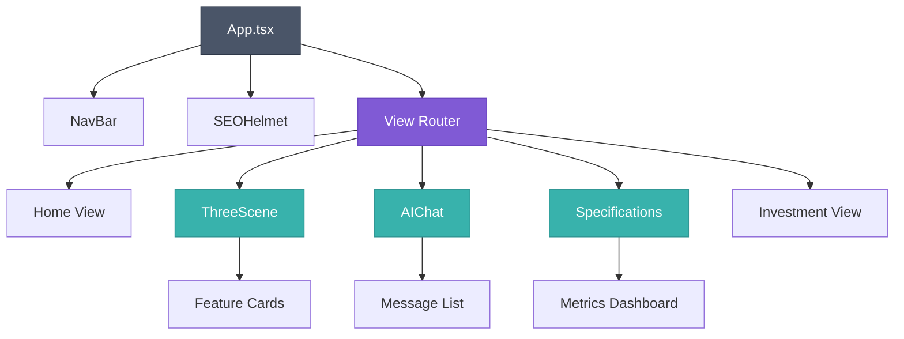

# LawnTech Dynamics - Architecture Documentation

This document provides a comprehensive overview of the LawnTech Dynamics project architecture, including project structure, component hierarchy, data flow, build process, and deployment pipeline.

## Table of Contents

- [Project Overview](#project-overview)
- [Technology Stack](#technology-stack)
- [Project Structure](#project-structure)
- [Component Hierarchy](#component-hierarchy)
- [Data Flow](#data-flow)
- [State Management](#state-management)
- [Routing and Navigation](#routing-and-navigation)
- [API Integration](#api-integration)
- [Build Process](#build-process)
- [Deployment Pipeline](#deployment-pipeline)
- [Performance Optimization](#performance-optimization)
- [Testing Architecture](#testing-architecture)
- [Security Considerations](#security-considerations)

---

## Project Overview

LawnTech Dynamics is a **React-based single-page application (SPA)** that showcases an innovative autonomous indoor grass court tennis facility. The application features:

- **Interactive 3D facility visualization** using Three.js
- **AI-powered chat assistant** using Google Gemini AI
- **Responsive design** with Tailwind CSS
- **Smooth animations** with Framer Motion
- **Performance-optimized** with code splitting and lazy loading

### Key Features

1. **Home Page**: Hero section, features overview, and facility information
2. **3D Demo**: Interactive Three.js visualization of the facility
3. **AI Chat**: Conversational interface powered by Google Gemini
4. **Specifications**: Detailed technical specifications and analytics
5. **Investment Portal**: Information for potential investors

---

## Technology Stack

### Frontend Framework

```
┌─────────────────────────────────────────────┐
│             React 19 (TypeScript)           │
│  Modern React with concurrent features      │
└─────────────────────────────────────────────┘
                     │
        ┌────────────┼────────────┐
        ▼            ▼            ▼
   ┌────────┐  ┌─────────┐  ┌──────────┐
   │ Vite   │  │ Three.js│  │  Framer  │
   │ Build  │  │   3D    │  │  Motion  │
   └────────┘  └─────────┘  └──────────┘
```

### Core Dependencies

| Package | Version | Purpose |
|---------|---------|---------|
| **react** | ^19.2.0 | UI framework with modern features |
| **react-dom** | ^19.2.0 | React DOM rendering |
| **typescript** | ~5.8.2 | Type safety and developer experience |
| **vite** | ^6.2.0 | Build tool and dev server |
| **three** | ^0.181.2 | 3D graphics and visualization |
| **@react-three/fiber** | ^9.4.0 | React renderer for Three.js |
| **@react-three/drei** | ^10.7.7 | Helper components for Three.js |
| **framer-motion** | ^12.23.24 | Animation library |
| **@google/genai** | ^1.30.0 | Google Gemini AI integration |
| **lucide-react** | ^0.554.0 | Icon library |
| **tailwind CSS** | via PostCSS | Utility-first CSS framework |

### Development Tools

| Tool | Purpose |
|------|---------|
| **Vitest** | Unit testing framework |
| **Playwright** | End-to-end testing |
| **ESLint** | Code quality and linting |
| **Prettier** | Code formatting |
| **TypeScript** | Static type checking |

---

## Project Structure

### Directory Layout

```
ace/
├── .github/
│   ├── workflows/          # CI/CD GitHub Actions
│   │   └── deploy.yml      # Automated deployment workflow
│   └── DEPLOYMENT.md       # Deployment documentation
│
├── components/             # React components
│   ├── AIChat.tsx          # AI chat interface component
│   ├── ErrorBoundary.tsx   # Error handling wrapper
│   ├── LoadingSpinner.tsx  # Loading state indicator
│   ├── NavBar.tsx          # Navigation component
│   ├── NavBar.test.tsx     # Navigation tests
│   ├── OfflineFallback.tsx # Offline mode UI
│   ├── OfflineIndicator.tsx# Network status indicator
│   ├── SEOHelmet.tsx       # Meta tags and SEO
│   ├── Specifications.tsx  # Technical specs display
│   ├── Specifications.test.tsx
│   └── ThreeScene.tsx      # 3D Three.js scene
│
├── e2e/                    # End-to-end tests
│   └── app.spec.ts         # E2E test suite
│
├── public/                 # Static assets
│   ├── icons/              # Favicon and app icons
│   ├── screenshots/        # App screenshots for SEO
│   ├── robots.txt          # Search engine directives
│   ├── sitemap.xml         # Generated sitemap
│   └── manifest.json       # PWA manifest
│
├── scripts/                # Build and utility scripts
│   └── generate-sitemap.js # Sitemap generation
│
├── services/               # Business logic and API
│   ├── geminiService.ts    # Google Gemini AI service
│   └── seo.ts              # SEO utilities
│
├── test/                   # Test utilities
│   └── test-utils.tsx      # Testing helpers
│
├── types/                  # TypeScript type definitions
│   └── index.d.ts          # Global type declarations
│
├── utils/                  # Utility functions
│   ├── analytics.ts        # Web analytics utilities
│   ├── env.ts              # Environment validation
│   └── focusTrap.ts        # Accessibility utilities
│
├── App.tsx                 # Main application component
├── index.tsx               # Application entry point
├── types.ts                # Shared TypeScript types
│
├── vite.config.ts          # Vite build configuration
├── vitest.config.ts        # Vitest test configuration
├── playwright.config.ts    # Playwright E2E configuration
├── eslint.config.js        # ESLint configuration
├── tsconfig.json           # TypeScript configuration
│
├── .env.example            # Environment variables template
├── .editorconfig           # Editor configuration
├── .eslintignore           # ESLint ignore patterns
├── .prettierignore         # Prettier ignore patterns
├── .prettierrc             # Prettier configuration
│
├── CONTRIBUTING.md         # Contribution guidelines
├── ARCHITECTURE.md         # This file
├── ENVIRONMENT.md          # Environment setup guide
├── E2E_TESTING.md          # E2E testing guide
├── LINTING.md              # Linting configuration
├── PERFORMANCE.md          # Performance guide
├── SEO.md                  # SEO implementation
├── TYPESCRIPT.md           # TypeScript guidelines
│
├── package.json            # Dependencies and scripts
└── README.md               # Project overview
```

### Key Directories Explained

#### `/components`

Contains all React components. Each component follows these conventions:

- **Single responsibility**: Each component has one clear purpose
- **Co-located tests**: Test files are next to their components
- **TypeScript**: All components use TypeScript with proper typing
- **Lazy loading**: Heavy components are lazy-loaded for performance

#### `/services`

Business logic and external API integrations:

- **geminiService.ts**: Handles all Google Gemini AI interactions
- **seo.ts**: SEO-related utilities and meta tag management

#### `/utils`

Pure utility functions with no side effects:

- **analytics.ts**: Web Vitals and analytics tracking
- **env.ts**: Environment variable validation
- **focusTrap.ts**: Accessibility helpers for keyboard navigation

#### `/types`

TypeScript type definitions:

- **types.ts**: Shared types used across the application
- **types/index.d.ts**: Global type declarations and module augmentation

---

## Component Hierarchy

### Component Tree

```
App (Main Container)
│
├── NavBar
│   ├── Navigation Links
│   └── Mobile Menu
│
├── SEOHelmet (Meta Tags)
│
├── ErrorBoundary
│   └── [Wrapped Content]
│
└── AnimatePresence (View Router)
    │
    ├── Home View
    │   ├── Hero Section
    │   ├── Features Grid
    │   ├── Facility Layout
    │   ├── Technology Stack
    │   └── Investment CTA
    │
    ├── 3D Demo View
    │   ├── ThreeScene
    │   │   ├── 3D Models
    │   │   ├── Interactive Hotspots
    │   │   └── Camera Controls
    │   └── Feature Cards (Conditional)
    │
    ├── Chat View
    │   └── AIChat
    │       ├── Message List
    │       ├── Input Field
    │       └── Loading Indicator
    │
    ├── Specifications View
    │   └── Specifications
    │       ├── Performance Metrics
    │       └── Analytics Dashboard
    │
    └── Investment View
        ├── Investment Information
        └── Contact Form
```

### Component Relationships



### Component Loading Strategy

**Eager Loading** (loaded immediately):
- `NavBar.tsx` - Critical for navigation
- `LoadingSpinner.tsx` - Shown during lazy loading

**Lazy Loading** (loaded on demand):
```typescript
const ThreeScene = lazy(() => import('./components/ThreeScene'));
const AIChat = lazy(() => import('./components/AIChat'));
const Specifications = lazy(() => import('./components/Specifications'));
```

Benefits:
- Faster initial page load
- Smaller initial JavaScript bundle
- Better Time to Interactive (TTI)

---

## Data Flow

### Application State Flow

```
┌─────────────────────────────────────────────────────┐
│                    App.tsx (Root)                   │
│                                                     │
│  State:                                             │
│  - currentView: View                                │
│  - selectedFeature: FeatureData | null              │
└─────────────────────────────────────────────────────┘
                        │
        ┌───────────────┼───────────────┐
        ▼               ▼               ▼
   ┌─────────┐    ┌─────────┐    ┌─────────────┐
   │ NavBar  │    │ Views   │    │ ThreeScene  │
   │         │    │         │    │             │
   │ Props:  │    │ Props:  │    │ Props:      │
   │ - view  │    │ - data  │    │ - feature   │
   │ - onNav │    │         │    │ - onSelect  │
   └─────────┘    └─────────┘    └─────────────┘
        │                              │
        └──────────────┬───────────────┘
                       ▼
              Event Handlers
              - setCurrentView()
              - setSelectedFeature()
```

### View State Management

The application uses **local component state** with React hooks:

```typescript
// App.tsx
const [currentView, setCurrentView] = useState<View>(View.HOME);
const [selectedFeature, setSelectedFeature] = useState<FeatureData | null>(null);
```

**View Enum:**
```typescript
export enum View {
  HOME = 'home',
  FACILITY_DEMO = 'demo',
  AI_CHAT = 'chat',
  SPECIFICATIONS = 'specs',
  INVEST = 'invest',
}
```

### Data Flow Patterns

#### 1. Top-Down Data Flow (Props)

```
App (State Owner)
  │
  ├─> NavBar (receives currentView, onChangeView)
  │
  └─> ThreeScene (receives selectedFeature, onFeatureSelect)
```

#### 2. Bottom-Up Events (Callbacks)

```
User clicks in ThreeScene
  │
  └─> onFeatureSelect(feature)
        │
        └─> App.setSelectedFeature(feature)
              │
              └─> Re-render with new state
```

#### 3. Side Effects (useEffect)

```typescript
// Reset feature when leaving demo view
useEffect(() => {
  if (currentView !== View.FACILITY_DEMO) {
    setSelectedFeature(null);
  }
}, [currentView]);
```

---

## State Management

### Local State Strategy

The application uses **React local state** instead of global state management (Redux, Zustand, etc.) because:

1. **Simple state requirements**: Only view and feature selection
2. **Limited component tree depth**: State doesn't need to be shared deeply
3. **Performance**: No unnecessary re-renders or complex selectors
4. **Maintainability**: Easier to understand and debug

### State Locations

| State | Location | Scope | Purpose |
|-------|----------|-------|---------|
| `currentView` | App.tsx | Global | Current page view |
| `selectedFeature` | App.tsx | Global | Selected 3D feature |
| Chat messages | AIChat.tsx | Component | Chat conversation history |
| 3D camera | ThreeScene.tsx | Component | Camera position/rotation |
| Form inputs | Various | Component | Form field values |

### Future State Considerations

If the application grows more complex, consider:

- **Zustand** for lightweight global state
- **React Context** for theme or auth state
- **TanStack Query** for server state and caching

---

## Routing and Navigation

### View-Based Navigation

The application uses a **view-based routing** system rather than URL-based routing:

```typescript
// No React Router - uses state-based views
const [currentView, setCurrentView] = useState<View>(View.HOME);
```

**Why View-Based?**

1. **Single-page experience**: Smooth transitions without URL changes
2. **Animation-friendly**: Framer Motion AnimatePresence works seamlessly
3. **Simpler state**: No need for route parameters or query strings
4. **GitHub Pages compatible**: No need for 404 handling or hash routing

### Navigation Flow

```
User clicks Nav Link
       ↓
NavBar.onChangeView(View.CHAT)
       ↓
App.setCurrentView(View.CHAT)
       ↓
AnimatePresence switches view
       ↓
AIChat component mounts
```

### View Transitions

Powered by Framer Motion:

```typescript
const pageVariants = {
  initial: { opacity: 0, y: 20 },
  enter: { opacity: 1, y: 0, transition: { duration: 0.6 } },
  exit: { opacity: 0, y: -20, transition: { duration: 0.4 } },
};
```

---

## API Integration

### Google Gemini AI Service

**Architecture:**

```
AIChat Component
      ↓
  geminiService.ts
      ↓
  @google/genai SDK
      ↓
  Google Gemini API
```

**Service Layer (`geminiService.ts`):**

```typescript
export async function sendMessage(message: string): Promise<string> {
  // API key validation
  // Request formatting
  // Error handling
  // Response processing
}
```

**Benefits of Service Layer:**

1. **Separation of concerns**: Business logic separate from UI
2. **Testability**: Easy to mock for testing
3. **Reusability**: Can be used by multiple components
4. **Error handling**: Centralized error management

### Environment Variables

API keys are managed through Vite's environment system:

```typescript
// utils/env.ts
export function validateEnv() {
  const apiKey = import.meta.env.VITE_GEMINI_API_KEY;
  if (!apiKey) {
    throw new Error('VITE_GEMINI_API_KEY is required');
  }
  return apiKey;
}
```

**Security:**
- API keys never committed to version control
- `.env.local` is git-ignored
- Environment validation at app startup

---

## Build Process

### Build Pipeline

```
┌──────────────────────────────────────────────────┐
│  1. Source Code (.tsx, .ts, .css)               │
└──────────────────┬───────────────────────────────┘
                   ▼
┌──────────────────────────────────────────────────┐
│  2. TypeScript Compilation                       │
│     - Type checking                              │
│     - Transpilation to JavaScript                │
└──────────────────┬───────────────────────────────┘
                   ▼
┌──────────────────────────────────────────────────┐
│  3. Vite Build Process                           │
│     - Module bundling                            │
│     - Code splitting                             │
│     - Asset optimization                         │
│     - CSS processing (Tailwind)                  │
└──────────────────┬───────────────────────────────┘
                   ▼
┌──────────────────────────────────────────────────┐
│  4. Minification & Optimization                  │
│     - Terser minification                        │
│     - Tree shaking                               │
│     - Dead code elimination                      │
│     - Console log removal                        │
└──────────────────┬───────────────────────────────┘
                   ▼
┌──────────────────────────────────────────────────┐
│  5. Asset Generation                             │
│     - Sitemap generation                         │
│     - Bundle analysis (optional)                 │
└──────────────────┬───────────────────────────────┘
                   ▼
┌──────────────────────────────────────────────────┐
│  6. Output: /dist directory                      │
│     - index.html                                 │
│     - /assets/js/[chunks].js                     │
│     - /assets/css/[styles].css                   │
│     - /assets/images/                            │
└──────────────────────────────────────────────────┘
```

### Vite Configuration Highlights

**Code Splitting Strategy:**

```typescript
// vite.config.ts
manualChunks: {
  'react-vendor': ['react', 'react-dom'],
  'three-vendor': ['three', '@react-three/fiber', '@react-three/drei'],
  'animation-vendor': ['framer-motion'],
  'ai-vendor': ['@google/genai'],
  'ui-vendor': ['lucide-react'],
}
```

**Why Manual Chunks?**

1. **Better caching**: Vendor code changes less frequently
2. **Parallel loading**: Browser can load chunks simultaneously
3. **Optimized bundle size**: Prevents duplication across chunks

**Build Optimization:**

- **Terser minification**: Aggressive compression
- **Tree shaking**: Removes unused code
- **CSS minification**: Compressed stylesheets
- **Source maps disabled**: Smaller production bundles
- **Console removal**: All console.log statements removed in production

### Build Commands

```bash
# Development build (fast, unoptimized)
npm run dev

# Production build
npm run build

# Production build with bundle analysis
npm run build:analyze

# Preview production build locally
npm run preview
```

---

## Deployment Pipeline

### GitHub Actions Workflow

```
┌─────────────────────────────────────────────┐
│  Trigger: Push to 'main' or 'dev' branch    │
└──────────────────┬──────────────────────────┘
                   ▼
┌─────────────────────────────────────────────┐
│  Job 1: Build & Test                        │
│                                             │
│  1. Checkout main branch                    │
│  2. Setup Node.js (v20)                     │
│  3. Install dependencies                    │
│  4. Build main (VITE_BASE_PATH=/ace/)       │
│  5. Copy to deploy/                         │
└──────────────────┬──────────────────────────┘
                   ▼
┌─────────────────────────────────────────────┐
│  6. Checkout dev branch                     │
│  7. Install dependencies                    │
│  8. Build dev (VITE_BASE_PATH=/ace/dev/)    │
│  9. Copy to deploy/dev/                     │
└──────────────────┬──────────────────────────┘
                   ▼
┌─────────────────────────────────────────────┐
│  10. Upload combined artifact               │
└──────────────────┬──────────────────────────┘
                   ▼
┌─────────────────────────────────────────────┐
│  Job 2: Deploy                              │
│                                             │
│  1. Deploy to GitHub Pages                  │
│  2. Set environment URL                     │
└──────────────────┬──────────────────────────┘
                   ▼
┌─────────────────────────────────────────────┐
│  Deployed Sites:                            │
│  - Production: /ace/                        │
│  - Development: /ace/dev/                   │
└─────────────────────────────────────────────┘
```

### Deployment Architecture

```
GitHub Repository
      │
      ├─── main branch
      │      │
      │      └─> Build with base=/ace/
      │            │
      │            └─> Deploy to /
      │
      └─── dev branch
             │
             └─> Build with base=/ace/dev/
                   │
                   └─> Deploy to /dev/

Final Structure:
  kvnloo.github.io/ace/        (main branch)
  kvnloo.github.io/ace/dev/    (dev branch)
```

### Multi-Environment Strategy

**Why Two Environments?**

1. **Testing**: Test changes in `/dev/` before merging to main
2. **Stability**: Production site remains stable
3. **Parallel development**: Multiple features can be previewed
4. **Rollback safety**: Easy to revert production without affecting dev

**Base Path Configuration:**

```typescript
// vite.config.ts
const base = process.env.VITE_BASE_PATH || '/';
```

Set during build:
- **Main**: `VITE_BASE_PATH=/ace/`
- **Dev**: `VITE_BASE_PATH=/ace/dev/`

This ensures all asset paths are correctly prefixed for GitHub Pages subpaths.

### Deployment Workflow Details

**`.github/workflows/deploy.yml`:**

```yaml
on:
  push:
    branches: [main, dev]

jobs:
  build-and-deploy:
    runs-on: ubuntu-latest
    steps:
      # Build main branch
      - name: Build main
        env:
          VITE_BASE_PATH: '/ace/'
        run: npm run build

      # Build dev branch
      - name: Build dev
        env:
          VITE_BASE_PATH: '/ace/dev/'
        run: npm run build

      # Deploy to GitHub Pages
      - name: Deploy
        uses: actions/deploy-pages@v4
```

---

## Performance Optimization

### Bundle Size Optimization

**Strategies Implemented:**

1. **Code Splitting**
   - Vendor chunks separated by library type
   - Lazy loading for heavy components
   - Dynamic imports for routes

2. **Tree Shaking**
   - ES modules throughout codebase
   - Named imports from libraries
   - Vite automatically removes unused code

3. **Minification**
   - Terser for JavaScript
   - CSS minification enabled
   - HTML minification in production

4. **Asset Optimization**
   - Images optimized and compressed
   - Fonts subset for used characters
   - SVG icons optimized

**Bundle Analysis:**

```bash
npm run build:analyze
```

Opens `dist/stats.html` showing:
- Chunk sizes (original and gzipped)
- Module dependencies
- Import relationships

### Runtime Performance

**Three.js Optimizations:**

```typescript
// Reduced polygon count for 3D models
// Efficient material usage
// Frustum culling enabled
// Automatic disposal of geometries and materials
```

**React Optimizations:**

```typescript
// Lazy loading heavy components
const ThreeScene = lazy(() => import('./components/ThreeScene'));

// Memoization where beneficial
const MemoizedComponent = React.memo(Component);
```

**Animation Performance:**

```typescript
// Framer Motion with GPU acceleration
// CSS transforms instead of layout properties
// Will-change hints for animated elements
```

### Core Web Vitals Targets

Defined in `package.json`:

| Metric | Target | Threshold |
|--------|--------|-----------|
| **LCP** (Largest Contentful Paint) | 2.5s | 4.0s |
| **FID** (First Input Delay) | 100ms | 300ms |
| **CLS** (Cumulative Layout Shift) | 0.1 | 0.25 |
| **TTFB** (Time to First Byte) | 800ms | 1.8s |
| **INP** (Interaction to Next Paint) | 200ms | 500ms |

**Monitoring:**

```typescript
// utils/analytics.ts
import { onCLS, onFID, onLCP, onTTFB, onINP } from 'web-vitals';

export function initWebVitals() {
  onCLS(console.log);
  onFID(console.log);
  onLCP(console.log);
  onTTFB(console.log);
  onINP(console.log);
}
```

---

## Testing Architecture

### Testing Pyramid

```
          ╱ ╲
         ╱ E2E╲         Small number of critical path tests
        ╱───────╲
       ╱ Integration╲   Component integration tests
      ╱─────────────╲
     ╱  Unit Tests   ╲  Large number of unit tests
    ╱─────────────────╲
```

### Unit Testing (Vitest)

**Framework:** Vitest + React Testing Library

**Test Location:** Co-located with components

```
components/
  NavBar.tsx
  NavBar.test.tsx
```

**Test Structure:**

```typescript
describe('NavBar', () => {
  it('renders navigation links', () => {
    // Arrange
    render(<NavBar currentView={View.HOME} onChangeView={vi.fn()} />);

    // Act
    const homeLink = screen.getByText('Home');

    // Assert
    expect(homeLink).toBeInTheDocument();
  });
});
```

**Coverage Configuration:**

```typescript
// vite.config.ts
coverage: {
  provider: 'v8',
  reporter: ['text', 'json', 'html'],
  include: ['components/**/*.{ts,tsx}', 'types.ts'],
  exclude: ['**/*.test.{ts,tsx}'],
}
```

### End-to-End Testing (Playwright)

**Framework:** Playwright

**Test Location:** `/e2e` directory

**Test Structure:**

```typescript
test('user can navigate to AI chat', async ({ page }) => {
  await page.goto('/');
  await page.click('text=AI Chat');
  await expect(page.locator('h2')).toContainText('Ask me anything');
});
```

**Cross-Browser Testing:**

```bash
npm run test:e2e:chromium   # Chromium
npm run test:e2e:firefox    # Firefox
npm run test:e2e:webkit     # WebKit (Safari)
npm run test:e2e:mobile     # Mobile viewports
```

**Configuration (`playwright.config.ts`):**

- Headless by default
- Screenshots on failure
- Video recording for debugging
- Parallel execution
- Automatic retry on failure

### Testing Best Practices

1. **Test behavior, not implementation**
2. **Use semantic queries** (getByRole, getByLabelText)
3. **Keep tests isolated** and independent
4. **Mock external dependencies** (API calls)
5. **Test accessibility** (a11y)

---

## Security Considerations

### Environment Variables

- ✅ API keys stored in `.env.local` (git-ignored)
- ✅ Environment validation at startup
- ✅ No secrets committed to repository
- ✅ Example template (`.env.example`) for contributors

### Content Security Policy

Recommended CSP headers for production:

```
Content-Security-Policy:
  default-src 'self';
  script-src 'self' 'unsafe-inline';
  style-src 'self' 'unsafe-inline';
  img-src 'self' data: https:;
  connect-src 'self' https://generativelanguage.googleapis.com;
```

### Dependencies

- Regular dependency audits: `npm audit`
- Automated updates via Dependabot
- Security patches applied promptly

### Best Practices

1. **Input validation** - Sanitize user inputs
2. **XSS prevention** - React escapes by default
3. **HTTPS only** - GitHub Pages enforces HTTPS
4. **No eval()** - Avoid dynamic code execution
5. **Type safety** - TypeScript prevents type-related bugs

---

## Conclusion

This architecture is designed for:

- **Performance**: Fast load times and smooth interactions
- **Maintainability**: Clear structure and separation of concerns
- **Scalability**: Easy to add new features and components
- **Developer Experience**: Modern tooling and clear conventions
- **Production Quality**: Comprehensive testing and deployment pipeline

For more information, refer to:
- [CONTRIBUTING.md](CONTRIBUTING.md) - Contribution guidelines
- [PERFORMANCE.md](PERFORMANCE.md) - Performance optimization guide
- [E2E_TESTING.md](E2E_TESTING.md) - Testing documentation
- [.github/DEPLOYMENT.md](.github/DEPLOYMENT.md) - Deployment process

---

**Last Updated:** 2025-11-23
