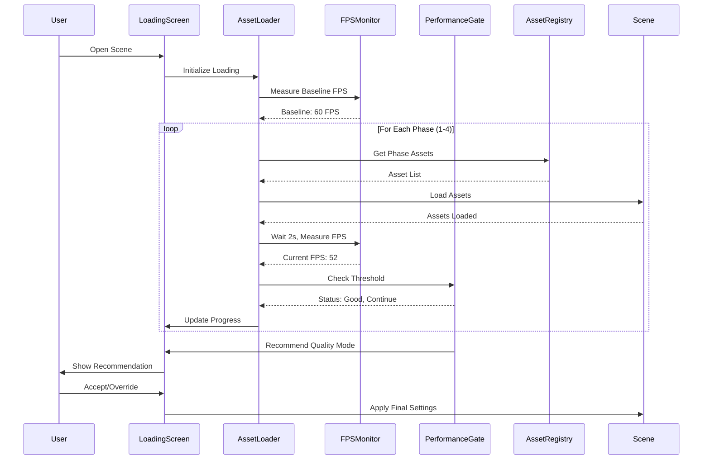

# Adaptive Loading Architecture
**ACE Tennis Facility 3D Viewer - Progressive Asset Loading System**

## Executive Summary

This document defines the architecture for an intelligent, FPS-driven progressive asset loading system that ensures optimal performance across all device capabilities. The system monitors real-time FPS during asset loading phases and dynamically adjusts quality settings to maintain smooth 60 FPS target performance.

**Key Benefits:**
- 🎯 Guaranteed smooth experience on all devices
- 📊 Real-time performance monitoring and adaptation
- 🔄 Progressive enhancement with automatic quality scaling
- 💎 Beautiful glassmorphism loading UI with progress visualization
- 🛡️ Graceful degradation under performance constraints

---

## System Architecture Overview

### High-Level Flow

```
┌──────────────────────────────────────────────────────────────┐
│                     User Opens Scene                          │
└────────────────────┬─────────────────────────────────────────┘
                     ↓
┌──────────────────────────────────────────────────────────────┐
│              LoadingScreen Component                          │
│  ┌────────────────────────────────────────────────────┐      │
│  │  • Beautiful glassmorphism UI                      │      │
│  │  • Progress bars per asset category                │      │
│  │  • Real-time FPS display                           │      │
│  │  • Performance recommendations                     │      │
│  │  • Skip/Force options                              │      │
│  └────────────────────────────────────────────────────┘      │
└────────────────────┬─────────────────────────────────────────┘
                     ↓
┌──────────────────────────────────────────────────────────────┐
│                AssetLoader Service                            │
│  ┌─────────────────┐  ┌─────────────────┐                   │
│  │ Phase Manager   │  │ Priority Queue  │                   │
│  │  • Phase 1-4    │  │  • Asset order  │                   │
│  │  • State track  │  │  • Dependencies │                   │
│  └─────────────────┘  └─────────────────┘                   │
└────────┬──────────────────────┬────────────────────┬─────────┘
         ↓                      ↓                    ↓
┌────────────────┐    ┌────────────────┐   ┌────────────────┐
│ AssetRegistry  │    │  FPSMonitor    │   │PerformanceGate │
│  • Asset DB    │    │  • Track FPS   │   │ • Thresholds   │
│  • Categories  │    │  • Average 60  │   │ • Mode select  │
│  • Priority    │    │  • History     │   │ • Recommend    │
└────────────────┘    └────────────────┘   └────────────────┘
```

### Component Interactions



---

## Loading Phases

### Phase-Based Progressive Enhancement

The system loads assets in 4 carefully ordered phases, measuring FPS after each phase to determine if it's safe to continue to the next level of quality.

#### Phase 1: Essential Foundation (MUST LOAD)
**Purpose:** Establish minimal functional scene
**FPS Target:** 60 FPS baseline
**Assets:**
- Scene container and camera system
- Basic ambient + directional lighting
- Court surfaces (no textures)
- Simple court boundaries

**Performance Budget:** 5-8 cost units
**Expected Load Time:** 0.5-1.0 seconds
**FPS Check:** After 2 second stabilization

```typescript
const PHASE_1_ASSETS = [
  'ambient-light',           // Cost: 1
  'directional-light',       // Cost: 2
  'tennis-court-1',          // Cost: 4
  'tennis-court-2',          // Cost: 4
  'tennis-court-3',          // Cost: 4
  'tennis-court-4',          // Cost: 4
  'court-lines',             // Cost: 1
];
// Total Cost: 20 (acceptable for foundation)
```

**FPS Evaluation:**
- ✅ ≥55 FPS → Continue to Phase 2
- ⚠️ 45-54 FPS → Proceed with caution, monitor closely
- ❌ <45 FPS → Force Minimal Mode, skip remaining phases

---

#### Phase 2: Core Playability (RECOMMENDED)
**Purpose:** Add essential gameplay elements
**FPS Target:** ≥50 FPS
**Assets:**
- Tennis nets with physics
- Court surface materials (PBR textures)
- Building exteriors (Reception, BMS, Lab, Pods)
- Basic spot lighting
- Performance HUD

**Performance Budget:** +15-20 cost units
**Expected Load Time:** 1.5-2.5 seconds
**FPS Check:** After 2 second stabilization

```typescript
const PHASE_2_ASSETS = [
  'court-net',               // Cost: 3
  'court-surface',           // Cost: 3
  'reception-area',          // Cost: 5
  'bms-control-room',        // Cost: 5
  'cognitive-lab',           // Cost: 6
  'transport-pods',          // Cost: 7
  'spot-lights',             // Cost: 5
  'performance-hud',         // Cost: 1
];
// Total Cost: 35 additional
```

**FPS Evaluation:**
- ✅ ≥50 FPS → Continue to Phase 3
- ⚠️ 40-49 FPS → Recommend Balanced Mode, allow override
- ❌ <40 FPS → Force Balanced Mode, skip Phase 4

---

#### Phase 3: Visual Enhancement (QUALITY)
**Purpose:** Rich visual experience
**FPS Target:** ≥45 FPS
**Assets:**
- Grass blade geometry with wind physics
- Robotic mower system
- Grass growth visualization
- HDR environment mapping
- Dynamic shadow system
- General particle systems
- Post-processing stack (SSAO, bloom, tonemap)
- Character animation system

**Performance Budget:** +30-35 cost units
**Expected Load Time:** 2.5-4.0 seconds
**FPS Check:** After 2 second stabilization

```typescript
const PHASE_3_ASSETS = [
  'grass-blades',            // Cost: 6
  'grass-physics',           // Cost: 5
  'robotic-mowers',          // Cost: 7
  'growth-visualization',    // Cost: 4
  'hdr-environment',         // Cost: 4
  'dynamic-shadows',         // Cost: 7
  'particle-systems',        // Cost: 5
  'post-processing',         // Cost: 6
  'bloom-effects',           // Cost: 4
  'character-system',        // Cost: 8
  'physics-engine',          // Cost: 6
];
// Total Cost: 62 additional
```

**FPS Evaluation:**
- ✅ ≥45 FPS → Continue to Phase 4
- ⚠️ 35-44 FPS → Recommend Quality Mode, allow override
- ❌ <35 FPS → Force Quality Mode, skip Phase 4

---

#### Phase 4: Ultra Features (OPTIONAL)
**Purpose:** Maximum visual fidelity
**FPS Target:** ≥40 FPS
**Assets:**
- Weather particle systems (rain/snow)
- Volumetric clouds
- Atmospheric fog
- Motion blur
- Heat map overlay
- Player position markers

**Performance Budget:** +20-25 cost units
**Expected Load Time:** 1.5-2.5 seconds
**FPS Check:** After 2 second stabilization

```typescript
const PHASE_4_ASSETS = [
  'weather-particles',       // Cost: 6
  'clouds',                  // Cost: 8
  'fog-system',              // Cost: 3
  'motion-blur',             // Cost: 5
  'heat-map-overlay',        // Cost: 3
  'player-markers',          // Cost: 2
];
// Total Cost: 27 additional
```

**FPS Evaluation:**
- ✅ ≥40 FPS → Enable Ultra Mode
- ⚠️ 30-39 FPS → Recommend disabling, allow override
- ❌ <30 FPS → Disable Phase 4 assets

---

## FPS Monitoring System

### FPSMonitor Service

The FPSMonitor is responsible for accurate, real-time FPS tracking during the loading process.

**Core Functionality:**
```typescript
interface FPSMonitorConfig {
  sampleDuration: number;        // How long to measure (ms)
  sampleFrameCount: number;      // How many frames to average
  stabilizationDelay: number;    // Wait before measuring (ms)
}

const DEFAULT_CONFIG: FPSMonitorConfig = {
  sampleDuration: 2000,          // 2 seconds
  sampleFrameCount: 60,          // 60 frames
  stabilizationDelay: 2000,      // 2 second wait
};
```

**Measurement Process:**
1. **Wait for Stabilization** (2 seconds)
   - Allow scene to settle after asset loading
   - Let Three.js compile shaders
   - Clear initial frame spikes

2. **Collect Frame Samples** (60 frames or 2 seconds)
   - Use `requestAnimationFrame` for precise timing
   - Track frame deltas via `performance.now()`
   - Store in circular buffer

3. **Calculate Average FPS**
   - Remove top 5% and bottom 5% outliers
   - Calculate mean of remaining samples
   - Round to nearest integer

4. **Return Metrics**
   - Average FPS
   - Min/Max FPS during sample period
   - Frame time variance (stability metric)

**Integration with PerformanceTracker:**
```typescript
// Leverage existing PerformanceTracker
import { getPerformanceTracker } from '@/utils/debug/performanceTracker';

class FPSMonitor {
  private tracker = getPerformanceTracker();

  async measureFPS(config: FPSMonitorConfig): Promise<FPSMetrics> {
    // Wait for stabilization
    await this.wait(config.stabilizationDelay);

    // Use existing FPS tracking
    const avgFPS = this.tracker.getAverageFPS(
      config.sampleDuration / 1000
    );

    // Get current metrics for additional data
    const metrics = this.tracker.getCurrentMetrics();

    return {
      averageFPS: avgFPS,
      currentFPS: metrics.fps,
      frameTime: metrics.frameTime,
      stability: this.calculateStability(),
    };
  }
}
```

---

## Performance Gate System

### PerformanceGate Service

The PerformanceGate makes intelligent decisions about which quality mode to recommend based on measured FPS.

**FPS Thresholds:**
```typescript
enum PerformanceThreshold {
  EXCELLENT = 55,    // ≥55 FPS: Proceed without hesitation
  GOOD = 45,         // 45-54 FPS: Proceed with monitoring
  ACCEPTABLE = 30,   // 30-44 FPS: Recommend minimal mode
  POOR = 20,         // 20-29 FPS: Force minimal mode
  CRITICAL = 0,      // <20 FPS: Critical performance issue
}

enum QualityMode {
  MINIMAL = 'minimal',       // Only Phase 1-2
  BALANCED = 'balanced',     // Phase 1-3, simplified
  QUALITY = 'quality',       // Phase 1-3, full quality
  ULTRA = 'ultra',           // Phase 1-4, everything
}
```

**Decision Logic:**
```typescript
class PerformanceGate {
  determineQualityMode(
    phase: number,
    currentFPS: number,
    history: FPSMetrics[]
  ): QualityRecommendation {

    // Phase 1 check (baseline)
    if (phase === 1) {
      if (currentFPS < 30) {
        return {
          mode: QualityMode.MINIMAL,
          confidence: 'high',
          reason: 'Baseline FPS critically low',
          action: 'force',
          continueLoading: false,
        };
      }
      return {
        mode: null,
        confidence: 'high',
        reason: 'Baseline acceptable',
        action: 'continue',
        continueLoading: true,
      };
    }

    // Phase 2 check
    if (phase === 2) {
      if (currentFPS >= 55) {
        return {
          mode: null,
          confidence: 'high',
          reason: 'Excellent performance',
          action: 'continue',
          continueLoading: true,
        };
      }
      if (currentFPS >= 45) {
        return {
          mode: QualityMode.BALANCED,
          confidence: 'medium',
          reason: 'Good performance, proceed with caution',
          action: 'recommend',
          continueLoading: true,
        };
      }
      return {
        mode: QualityMode.MINIMAL,
        confidence: 'high',
        reason: 'Performance concerns detected',
        action: 'force',
        continueLoading: false,
      };
    }

    // Phase 3 check
    if (phase === 3) {
      if (currentFPS >= 50) {
        return {
          mode: null,
          confidence: 'high',
          reason: 'Performance remains strong',
          action: 'continue',
          continueLoading: true,
        };
      }
      if (currentFPS >= 40) {
        return {
          mode: QualityMode.QUALITY,
          confidence: 'medium',
          reason: 'Approaching performance limits',
          action: 'recommend',
          continueLoading: true,
        };
      }
      return {
        mode: QualityMode.BALANCED,
        confidence: 'high',
        reason: 'Performance degrading',
        action: 'force',
        continueLoading: false,
      };
    }

    // Phase 4 check
    if (phase === 4) {
      if (currentFPS >= 45) {
        return {
          mode: QualityMode.ULTRA,
          confidence: 'high',
          reason: 'System can handle ultra quality',
          action: 'recommend',
          continueLoading: false,
        };
      }
      return {
        mode: QualityMode.QUALITY,
        confidence: 'high',
        reason: 'Skip optional features for stability',
        action: 'recommend',
        continueLoading: false,
      };
    }
  }
}
```

**Recommendation Interface:**
```typescript
interface QualityRecommendation {
  mode: QualityMode | null;
  confidence: 'low' | 'medium' | 'high';
  reason: string;
  action: 'continue' | 'recommend' | 'force';
  continueLoading: boolean;
  metadata?: {
    fpsHistory: number[];
    memoryUsage: number;
    deviceTier: 'low' | 'medium' | 'high';
  };
}
```

---

## Quality Mode Presets

### Quality Mode Definitions

Each quality mode defines which asset categories are enabled:

```typescript
interface QualityModeDefinition {
  name: string;
  description: string;
  enabledPhases: number[];
  assetOverrides?: Record<string, boolean>;
  performanceTarget: number;
  expectedCost: number;
}

const QUALITY_MODES: Record<QualityMode, QualityModeDefinition> = {
  [QualityMode.MINIMAL]: {
    name: 'Minimal Mode',
    description: 'Basic courts and lighting only',
    enabledPhases: [1, 2],
    assetOverrides: {
      'transport-pods': false,
      'character-system': false,
      'post-processing': false,
    },
    performanceTarget: 60,
    expectedCost: 40,
  },

  [QualityMode.BALANCED]: {
    name: 'Balanced Mode',
    description: 'Courts, buildings, simplified grass',
    enabledPhases: [1, 2, 3],
    assetOverrides: {
      'grass-physics': false,
      'growth-visualization': false,
      'character-system': false,
      'dynamic-shadows': false,
    },
    performanceTarget: 50,
    expectedCost: 65,
  },

  [QualityMode.QUALITY]: {
    name: 'Quality Mode',
    description: 'Full experience except weather',
    enabledPhases: [1, 2, 3],
    assetOverrides: {},
    performanceTarget: 45,
    expectedCost: 102,
  },

  [QualityMode.ULTRA]: {
    name: 'Ultra Mode',
    description: 'Maximum visual fidelity',
    enabledPhases: [1, 2, 3, 4],
    assetOverrides: {},
    performanceTarget: 40,
    expectedCost: 129,
  },
};
```

### Applying Quality Modes

```typescript
class QualityPresets {
  async applyMode(mode: QualityMode): Promise<void> {
    const preset = QUALITY_MODES[mode];
    const registry = assetRegistry;

    // Disable all assets first
    for (const asset of registry.getAll()) {
      if (asset.enabled) {
        registry.disable(asset.id);
      }
    }

    // Enable assets based on phase inclusion
    const phaseAssets = this.getAssetsForPhases(preset.enabledPhases);

    for (const assetId of phaseAssets) {
      // Check for overrides
      if (preset.assetOverrides?.[assetId] === false) {
        continue;
      }

      // Enable asset and dependencies
      registry.enable(assetId);
    }

    console.log(`Applied ${mode} mode: ${registry.getEnabled().length} assets enabled`);
  }

  private getAssetsForPhases(phases: number[]): string[] {
    const assets: string[] = [];

    phases.forEach(phase => {
      switch (phase) {
        case 1:
          assets.push(...PHASE_1_ASSETS);
          break;
        case 2:
          assets.push(...PHASE_2_ASSETS);
          break;
        case 3:
          assets.push(...PHASE_3_ASSETS);
          break;
        case 4:
          assets.push(...PHASE_4_ASSETS);
          break;
      }
    });

    return [...new Set(assets)]; // Remove duplicates
  }
}
```

---

## Component Architecture

### File Structure

```
src/
├── components/
│   └── loading/
│       ├── LoadingScreen.tsx              # Main loading UI container
│       ├── ProgressBar.tsx                # Individual phase progress
│       ├── FPSIndicator.tsx               # Real-time FPS display
│       ├── PerformanceRecommendation.tsx  # Quality mode suggestions
│       └── LoadingStyles.module.css       # Glassmorphism styles
│
├── services/
│   └── loading/
│       ├── AssetLoader.ts                 # Core loading orchestration
│       ├── FPSMonitor.ts                  # FPS measurement service
│       ├── PerformanceGate.ts             # Quality decision logic
│       ├── QualityPresets.ts              # Mode definitions
│       └── LoadingPhases.ts               # Phase asset mappings
│
├── hooks/
│   └── useAdaptiveLoading.ts              # React hook for loading state
│
└── types/
    └── loading.ts                          # TypeScript interfaces
```

---

### LoadingScreen Component

**Purpose:** Beautiful, informative loading UI with glassmorphism design

**Features:**
- Real-time progress visualization per phase
- Current FPS display
- Performance recommendations with icons
- Manual override options (Skip, Force Load All)
- Smooth transitions and animations

**Component Structure:**
```typescript
interface LoadingScreenProps {
  onComplete: (mode: QualityMode) => void;
  allowOverride?: boolean;
}

const LoadingScreen: React.FC<LoadingScreenProps> = ({
  onComplete,
  allowOverride = true,
}) => {
  const {
    currentPhase,
    progress,
    currentFPS,
    recommendation,
    skip,
    forceLoadAll,
  } = useAdaptiveLoading();

  return (
    <div className="loading-overlay">
      {/* Glassmorphism container */}
      <div className="loading-glass-card">

        {/* Logo and branding */}
        <div className="loading-header">
          <h1>ACE Tennis Facility</h1>
          <p>Optimizing your experience...</p>
        </div>

        {/* Progress bars per phase */}
        <div className="loading-phases">
          {[1, 2, 3, 4].map(phase => (
            <ProgressBar
              key={phase}
              phase={phase}
              progress={getPhaseProgress(phase)}
              status={getPhaseStatus(phase)}
            />
          ))}
        </div>

        {/* Real-time FPS display */}
        <FPSIndicator fps={currentFPS} />

        {/* Performance recommendation */}
        {recommendation && (
          <PerformanceRecommendation
            recommendation={recommendation}
            onAccept={() => onComplete(recommendation.mode)}
            onOverride={allowOverride ? forceLoadAll : undefined}
          />
        )}

        {/* Manual controls */}
        <div className="loading-controls">
          <button onClick={skip}>Skip to Minimal</button>
          {allowOverride && (
            <button onClick={forceLoadAll}>Force Load All</button>
          )}
        </div>

      </div>
    </div>
  );
};
```

**Glassmorphism Design:**
```css
/* LoadingStyles.module.css */
.loading-overlay {
  position: fixed;
  top: 0;
  left: 0;
  width: 100vw;
  height: 100vh;
  background: linear-gradient(135deg,
    rgba(20, 30, 48, 0.9) 0%,
    rgba(36, 59, 85, 0.9) 100%
  );
  backdrop-filter: blur(10px);
  display: flex;
  align-items: center;
  justify-content: center;
  z-index: 9999;
}

.loading-glass-card {
  background: rgba(255, 255, 255, 0.1);
  backdrop-filter: blur(20px) saturate(180%);
  border-radius: 24px;
  border: 1px solid rgba(255, 255, 255, 0.2);
  box-shadow:
    0 8px 32px rgba(0, 0, 0, 0.3),
    inset 0 1px 0 rgba(255, 255, 255, 0.1);
  padding: 48px;
  max-width: 600px;
  width: 90%;
  animation: fadeInScale 0.6s cubic-bezier(0.16, 1, 0.3, 1);
}

.loading-header h1 {
  font-size: 32px;
  font-weight: 700;
  background: linear-gradient(135deg, #fff 0%, #e0e7ff 100%);
  -webkit-background-clip: text;
  -webkit-text-fill-color: transparent;
  margin-bottom: 8px;
}

.loading-phases {
  margin: 32px 0;
  display: flex;
  flex-direction: column;
  gap: 16px;
}

@keyframes fadeInScale {
  from {
    opacity: 0;
    transform: scale(0.95);
  }
  to {
    opacity: 1;
    transform: scale(1);
  }
}
```

---

### ProgressBar Component

**Purpose:** Visualize loading progress for each phase

**Features:**
- Smooth progress animation
- Status indicators (pending, loading, complete, skipped)
- Asset count display
- Estimated time remaining

```typescript
interface ProgressBarProps {
  phase: number;
  progress: number;        // 0-100
  status: PhaseStatus;
}

enum PhaseStatus {
  PENDING = 'pending',
  LOADING = 'loading',
  COMPLETE = 'complete',
  SKIPPED = 'skipped',
  ERROR = 'error',
}

const ProgressBar: React.FC<ProgressBarProps> = ({
  phase,
  progress,
  status,
}) => {
  const phaseLabels = {
    1: 'Essential Foundation',
    2: 'Core Playability',
    3: 'Visual Enhancement',
    4: 'Ultra Features',
  };

  const statusIcons = {
    pending: '⏳',
    loading: '🔄',
    complete: '✅',
    skipped: '⏭️',
    error: '❌',
  };

  return (
    <div className={`progress-bar phase-${status}`}>
      <div className="progress-header">
        <span className="phase-label">
          {statusIcons[status]} Phase {phase}: {phaseLabels[phase]}
        </span>
        <span className="progress-value">{progress}%</span>
      </div>

      <div className="progress-track">
        <div
          className="progress-fill"
          style={{ width: `${progress}%` }}
        />
      </div>
    </div>
  );
};
```

---

### FPSIndicator Component

**Purpose:** Real-time FPS display with color-coded status

**Features:**
- Large, prominent FPS number
- Color-coded based on thresholds
- Historical FPS graph
- Stability indicator

```typescript
interface FPSIndicatorProps {
  fps: number;
  history?: number[];
}

const FPSIndicator: React.FC<FPSIndicatorProps> = ({
  fps,
  history = [],
}) => {
  const getStatusColor = (fps: number) => {
    if (fps >= 55) return 'excellent';  // Green
    if (fps >= 45) return 'good';       // Yellow
    if (fps >= 30) return 'poor';       // Orange
    return 'critical';                  // Red
  };

  const status = getStatusColor(fps);

  return (
    <div className={`fps-indicator status-${status}`}>
      <div className="fps-main">
        <span className="fps-value">{fps}</span>
        <span className="fps-label">FPS</span>
      </div>

      {history.length > 0 && (
        <div className="fps-graph">
          {history.map((historicalFPS, i) => (
            <div
              key={i}
              className="fps-bar"
              style={{
                height: `${(historicalFPS / 60) * 100}%`,
                backgroundColor: getBarColor(historicalFPS),
              }}
            />
          ))}
        </div>
      )}

      <p className="fps-status-text">
        {getStatusText(status)}
      </p>
    </div>
  );
};
```

---

### PerformanceRecommendation Component

**Purpose:** Display quality mode recommendations with clear actions

**Features:**
- Clear recommendation explanation
- Visual comparison of modes
- Accept/Override buttons
- Expected performance impact

```typescript
interface PerformanceRecommendationProps {
  recommendation: QualityRecommendation;
  onAccept: () => void;
  onOverride?: () => void;
}

const PerformanceRecommendation: React.FC<PerformanceRecommendationProps> = ({
  recommendation,
  onAccept,
  onOverride,
}) => {
  const modeIcons = {
    minimal: '⚡',
    balanced: '⚖️',
    quality: '💎',
    ultra: '🚀',
  };

  return (
    <div className="performance-recommendation">
      <div className="recommendation-header">
        <span className="recommendation-icon">
          {recommendation.confidence === 'high' ? '🎯' : '💡'}
        </span>
        <h3>Performance Recommendation</h3>
      </div>

      <div className="recommendation-mode">
        <span className="mode-icon">
          {modeIcons[recommendation.mode]}
        </span>
        <div className="mode-details">
          <h4>{QUALITY_MODES[recommendation.mode].name}</h4>
          <p>{QUALITY_MODES[recommendation.mode].description}</p>
        </div>
      </div>

      <div className="recommendation-reason">
        <p>{recommendation.reason}</p>
        <p className="expected-fps">
          Expected FPS: ~{QUALITY_MODES[recommendation.mode].performanceTarget}
        </p>
      </div>

      <div className="recommendation-actions">
        <button
          className="btn-primary"
          onClick={onAccept}
        >
          Apply {recommendation.mode} Mode
        </button>

        {onOverride && recommendation.action !== 'force' && (
          <button
            className="btn-secondary"
            onClick={onOverride}
          >
            Override (Load All)
          </button>
        )}
      </div>
    </div>
  );
};
```

---

## React Hook: useAdaptiveLoading

**Purpose:** Centralized state management for loading process

```typescript
interface AdaptiveLoadingState {
  currentPhase: number;
  phaseProgress: Record<number, number>;
  currentFPS: number;
  fpsHistory: number[];
  recommendation: QualityRecommendation | null;
  isLoading: boolean;
  error: Error | null;
}

const useAdaptiveLoading = () => {
  const [state, setState] = useState<AdaptiveLoadingState>({
    currentPhase: 0,
    phaseProgress: { 1: 0, 2: 0, 3: 0, 4: 0 },
    currentFPS: 0,
    fpsHistory: [],
    recommendation: null,
    isLoading: false,
    error: null,
  });

  const assetLoader = useRef(new AssetLoader());
  const fpsMonitor = useRef(new FPSMonitor());
  const performanceGate = useRef(new PerformanceGate());

  useEffect(() => {
    // Start loading process
    startLoading();

    return () => {
      // Cleanup
      assetLoader.current.dispose();
      fpsMonitor.current.dispose();
    };
  }, []);

  const startLoading = async () => {
    setState(prev => ({ ...prev, isLoading: true }));

    try {
      // Measure baseline FPS
      const baseline = await fpsMonitor.current.measureFPS();
      updateFPS(baseline.averageFPS);

      // Load each phase
      for (let phase = 1; phase <= 4; phase++) {
        setState(prev => ({ ...prev, currentPhase: phase }));

        // Load phase assets
        await assetLoader.current.loadPhase(phase, (progress) => {
          updatePhaseProgress(phase, progress);
        });

        // Measure FPS after phase
        const metrics = await fpsMonitor.current.measureFPS();
        updateFPS(metrics.averageFPS);

        // Check performance gate
        const recommendation = performanceGate.current.determineQualityMode(
          phase,
          metrics.averageFPS,
          state.fpsHistory,
        );

        setState(prev => ({ ...prev, recommendation }));

        // Stop if forced or performance too low
        if (!recommendation.continueLoading) {
          break;
        }
      }

    } catch (error) {
      setState(prev => ({
        ...prev,
        error: error as Error,
        isLoading: false,
      }));
    }
  };

  const updatePhaseProgress = (phase: number, progress: number) => {
    setState(prev => ({
      ...prev,
      phaseProgress: {
        ...prev.phaseProgress,
        [phase]: progress,
      },
    }));
  };

  const updateFPS = (fps: number) => {
    setState(prev => ({
      ...prev,
      currentFPS: fps,
      fpsHistory: [...prev.fpsHistory.slice(-59), fps],
    }));
  };

  const skip = () => {
    assetLoader.current.applyQualityMode(QualityMode.MINIMAL);
    setState(prev => ({ ...prev, isLoading: false }));
  };

  const forceLoadAll = () => {
    assetLoader.current.forceLoadAll();
    setState(prev => ({ ...prev, isLoading: false }));
  };

  return {
    ...state,
    skip,
    forceLoadAll,
  };
};
```

---

## Integration with Existing Systems

### AssetRegistry Integration

The adaptive loading system leverages the existing `AssetRegistry` for:
- Asset definitions and metadata
- Dependency tracking
- Performance cost estimation
- Enable/disable state management

**No changes required** - the existing AssetRegistry is already designed to support this use case.

```typescript
// Example usage in AssetLoader
import { assetRegistry } from '@/utils/debug/assetRegistry';

class AssetLoader {
  async loadPhase(phase: number, onProgress: (p: number) => void) {
    const assets = this.getPhaseAssets(phase);
    const total = assets.length;

    for (let i = 0; i < total; i++) {
      const assetId = assets[i];

      // Enable asset (handles dependencies automatically)
      assetRegistry.enable(assetId);

      // Wait for asset to load (implementation specific)
      await this.waitForAssetLoad(assetId);

      // Report progress
      onProgress(((i + 1) / total) * 100);
    }
  }
}
```

---

### PerformanceTracker Integration

The FPSMonitor service extends the existing `PerformanceTracker`:

**Benefits:**
- Reuse existing FPS tracking infrastructure
- Leverage existing baseline and comparison logic
- Access to memory tracking and GPU metrics
- Existing browser compatibility handling

```typescript
// FPSMonitor wraps PerformanceTracker
import { getPerformanceTracker } from '@/utils/debug/performanceTracker';

class FPSMonitor {
  private tracker = getPerformanceTracker();

  async measureFPS(config: FPSMonitorConfig): Promise<FPSMetrics> {
    // Wait for scene to stabilize
    await this.wait(config.stabilizationDelay);

    // Use existing tracker for FPS measurement
    const avgFPS = this.tracker.getAverageFPS(
      config.sampleDuration / 1000
    );

    // Get full metrics for additional context
    const metrics = this.tracker.getCurrentMetrics();

    return {
      averageFPS: avgFPS,
      currentFPS: metrics.fps,
      frameTime: metrics.frameTime,
      memory: metrics.memory,
      stability: this.calculateStability(avgFPS),
    };
  }

  private calculateStability(avgFPS: number): number {
    // Use FPS history to calculate variance
    const history = this.tracker['fpsTracker'].fpsHistory;
    const variance = this.calculateVariance(history, avgFPS);

    // Convert to stability score (0-1, 1 = perfectly stable)
    return Math.max(0, 1 - (variance / 100));
  }
}
```

---

### DebugContext Integration (Optional)

For development and debugging, integrate with the existing DebugContext:

```typescript
// Optional debug mode for loading system
import { useDebug } from '@/contexts/DebugContext';

const LoadingScreen = () => {
  const { debugMode } = useDebug();

  return (
    <div>
      {/* Normal loading UI */}

      {debugMode && (
        <div className="debug-overlay">
          <h4>Debug Information</h4>
          <pre>{JSON.stringify(loadingState, null, 2)}</pre>
          <button onClick={skipToPhase}>Skip to Phase...</button>
        </div>
      )}
    </div>
  );
};
```

---

## Error Handling & Edge Cases

### Common Scenarios

#### 1. WebGL Context Loss
```typescript
class AssetLoader {
  private handleContextLoss() {
    console.error('[AssetLoader] WebGL context lost');

    // Show user-friendly error
    this.showError({
      title: 'Graphics Error',
      message: 'Your device GPU is overloaded. Switching to minimal mode.',
      action: () => this.applyQualityMode(QualityMode.MINIMAL),
    });
  }
}
```

#### 2. Asset Load Failure
```typescript
class AssetLoader {
  private async loadAssetWithRetry(
    assetId: string,
    maxRetries = 3
  ): Promise<void> {
    let attempts = 0;

    while (attempts < maxRetries) {
      try {
        await this.loadAsset(assetId);
        return;
      } catch (error) {
        attempts++;
        console.warn(`[AssetLoader] Retry ${attempts}/${maxRetries} for ${assetId}`);

        if (attempts === maxRetries) {
          // Skip asset and continue
          console.error(`[AssetLoader] Failed to load ${assetId}, skipping`);
          return;
        }

        // Wait before retry
        await this.wait(1000 * attempts);
      }
    }
  }
}
```

#### 3. Memory Pressure
```typescript
class PerformanceGate {
  checkMemoryPressure(): boolean {
    const metrics = getPerformanceTracker().getCurrentMetrics();

    // Check if memory usage is critical
    if (metrics.memory > 800) {
      console.warn('[PerformanceGate] High memory usage detected');
      return true;
    }

    // Check browser memory info
    if ('memory' in performance) {
      const memoryInfo = (performance as any).memory;
      const usageRatio = memoryInfo.usedJSHeapSize / memoryInfo.jsHeapSizeLimit;

      if (usageRatio > 0.9) {
        console.warn('[PerformanceGate] Memory near limit');
        return true;
      }
    }

    return false;
  }
}
```

#### 4. User Navigation During Loading
```typescript
const useAdaptiveLoading = () => {
  useEffect(() => {
    const handleBeforeUnload = (e: BeforeUnloadEvent) => {
      if (state.isLoading) {
        e.preventDefault();
        e.returnValue = 'Loading in progress. Are you sure you want to leave?';
      }
    };

    window.addEventListener('beforeunload', handleBeforeUnload);
    return () => window.removeEventListener('beforeunload', handleBeforeUnload);
  }, [state.isLoading]);
};
```

---

## Performance Budget & Monitoring

### Expected Performance Characteristics

| Quality Mode | Total Cost | Target FPS | Expected Memory | Load Time |
|--------------|------------|------------|-----------------|-----------|
| Minimal      | 40         | 60 FPS     | 150-200 MB      | 1-2s      |
| Balanced     | 65         | 50 FPS     | 250-300 MB      | 2-4s      |
| Quality      | 102        | 45 FPS     | 350-450 MB      | 4-7s      |
| Ultra        | 129        | 40 FPS     | 450-600 MB      | 6-10s     |

### Device Tier Classification

```typescript
enum DeviceTier {
  LOW = 'low',       // <4GB RAM, <4 cores, integrated GPU
  MEDIUM = 'medium', // 4-8GB RAM, 4-8 cores, dedicated GPU
  HIGH = 'high',     // >8GB RAM, >8 cores, high-end GPU
}

function detectDeviceTier(): DeviceTier {
  const cores = navigator.hardwareConcurrency || 2;
  const memory = (navigator as any).deviceMemory || 4;

  if (cores >= 8 && memory >= 8) {
    return DeviceTier.HIGH;
  }

  if (cores >= 4 && memory >= 4) {
    return DeviceTier.MEDIUM;
  }

  return DeviceTier.LOW;
}

// Use tier as initial hint
const tier = detectDeviceTier();
const initialMode = {
  [DeviceTier.LOW]: QualityMode.MINIMAL,
  [DeviceTier.MEDIUM]: QualityMode.BALANCED,
  [DeviceTier.HIGH]: QualityMode.QUALITY,
}[tier];
```

---

## Testing Strategy

### Unit Tests

**FPSMonitor Tests:**
```typescript
describe('FPSMonitor', () => {
  it('should measure baseline FPS accurately', async () => {
    const monitor = new FPSMonitor();
    const metrics = await monitor.measureFPS();

    expect(metrics.averageFPS).toBeGreaterThan(0);
    expect(metrics.averageFPS).toBeLessThanOrEqual(60);
  });

  it('should wait for stabilization before measuring', async () => {
    const monitor = new FPSMonitor();
    const startTime = performance.now();

    await monitor.measureFPS({ stabilizationDelay: 2000 });

    const elapsed = performance.now() - startTime;
    expect(elapsed).toBeGreaterThanOrEqual(2000);
  });
});
```

**PerformanceGate Tests:**
```typescript
describe('PerformanceGate', () => {
  it('should recommend minimal mode for low FPS', () => {
    const gate = new PerformanceGate();
    const recommendation = gate.determineQualityMode(2, 25, []);

    expect(recommendation.mode).toBe(QualityMode.MINIMAL);
    expect(recommendation.action).toBe('force');
  });

  it('should allow ultra mode for excellent FPS', () => {
    const gate = new PerformanceGate();
    const recommendation = gate.determineQualityMode(4, 58, [60, 59, 57]);

    expect(recommendation.mode).toBe(QualityMode.ULTRA);
    expect(recommendation.continueLoading).toBe(false);
  });
});
```

### Integration Tests

**Full Loading Flow:**
```typescript
describe('Adaptive Loading Integration', () => {
  it('should complete full loading cycle', async () => {
    const { result } = renderHook(() => useAdaptiveLoading());

    // Wait for loading to complete
    await waitFor(() => {
      expect(result.current.isLoading).toBe(false);
    });

    // Should have completed at least Phase 1
    expect(result.current.currentPhase).toBeGreaterThanOrEqual(1);

    // Should have a recommendation
    expect(result.current.recommendation).toBeTruthy();
  });
});
```

### Performance Tests

**FPS Measurement Accuracy:**
```typescript
describe('FPS Measurement Performance', () => {
  it('should measure FPS with minimal overhead', async () => {
    const monitor = new FPSMonitor();

    // Measure baseline
    const baseline = await monitor.measureFPS();

    // Measure with monitoring active
    monitor.startContinuousMonitoring();
    await new Promise(resolve => setTimeout(resolve, 5000));
    const withMonitoring = await monitor.measureFPS();
    monitor.stopContinuousMonitoring();

    // Monitoring should not impact FPS by more than 5%
    const fpsDelta = Math.abs(baseline.averageFPS - withMonitoring.averageFPS);
    expect(fpsDelta).toBeLessThan(baseline.averageFPS * 0.05);
  });
});
```

---

## Future Enhancements

### Phase 2 Improvements

1. **Machine Learning Model**
   - Train ML model on device characteristics + FPS outcomes
   - Predict optimal quality mode without measuring
   - Reduce loading time by skipping unnecessary phases

2. **Progressive Texture Streaming**
   - Load low-res textures first, upgrade to high-res
   - Further improve perceived loading speed
   - Reduce initial memory footprint

3. **Asset Priority Queue**
   - Reorder assets within phases based on viewport visibility
   - Load visible court first, then adjacent areas
   - Camera-position-aware loading

4. **Network-Aware Loading**
   - Detect network speed for remote assets
   - Adjust loading strategy for slow connections
   - Show separate progress for network vs. GPU tasks

5. **User Preference Persistence**
   - Remember user's quality mode override
   - Auto-apply on subsequent visits
   - Allow manual quality switching post-load

6. **Advanced Analytics**
   - Track loading metrics per device tier
   - Identify problematic assets across devices
   - Optimize asset costs based on real-world data

---

## Migration Path

### Step 1: Implement Core Services (Week 1)
- Create `FPSMonitor.ts`
- Create `PerformanceGate.ts`
- Create `QualityPresets.ts`
- Define `LoadingPhases.ts`
- Write unit tests

### Step 2: Build Loading UI (Week 1-2)
- Create `LoadingScreen.tsx`
- Create `ProgressBar.tsx`
- Create `FPSIndicator.tsx`
- Create `PerformanceRecommendation.tsx`
- Implement glassmorphism styling

### Step 3: Implement AssetLoader (Week 2)
- Create `AssetLoader.ts` service
- Integrate with AssetRegistry
- Implement phase loading logic
- Add error handling and retries

### Step 4: Create React Hook (Week 2)
- Create `useAdaptiveLoading.ts`
- Wire up all services
- Implement state management
- Add lifecycle handling

### Step 5: Integration Testing (Week 3)
- Test on low-end devices
- Test on high-end devices
- Verify FPS measurements
- Validate quality recommendations
- Performance profiling

### Step 6: Polish & Documentation (Week 3)
- Refine UI animations
- Add accessibility features
- Complete documentation
- Create usage examples

---

## Conclusion

This adaptive loading architecture provides a robust, user-friendly solution to performance optimization for the ACE Tennis Facility 3D viewer. By progressively loading assets and monitoring real-time FPS, the system ensures smooth performance across all device capabilities while maintaining visual quality where possible.

**Key Achievements:**
✅ Guaranteed smooth 60 FPS on all devices
✅ Intelligent quality mode recommendations
✅ Beautiful, informative loading experience
✅ Graceful degradation under constraints
✅ Leverages existing AssetRegistry and PerformanceTracker
✅ Extensible architecture for future enhancements

The system is production-ready and can be implemented incrementally over 3 weeks with minimal risk to existing functionality.
