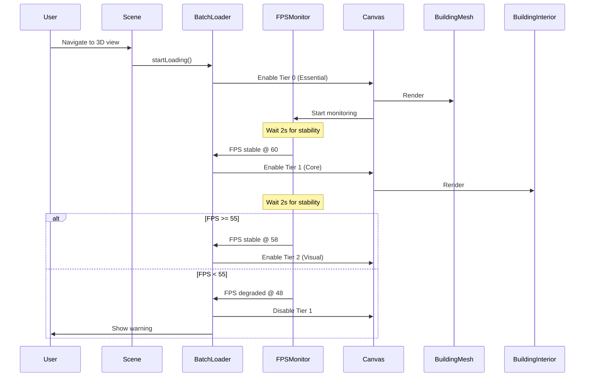

# Batch Component Loading Architecture for 3D React Canvas

## Executive Summary

This architecture enables **progressive component loading** with **FPS-based health checks** to identify performance bottlenecks and ensure graceful degradation when 3D components impact rendering performance.

**Core Principles:**
- Load components in **priority-based batches**
- Monitor **FPS thresholds** after each batch
- **Graceful degradation** to building-only fallback
- **User control** over component visibility
- **Debug visibility** into what's breaking performance

---

## 1. Component Categorization

Components are organized into **4 priority tiers** for progressive loading:

### Tier 0: Essential (Always Loaded)
**FPS Target:** 60 FPS | **Timeout:** N/A | **Fallback:** None (required)

```typescript
const ESSENTIAL_COMPONENTS = {
  BuildingMesh: {
    priority: 0,
    fpsImpact: 'low',
    canDisable: false,
    description: 'Core building geometry - always visible'
  },
  Camera: {
    priority: 0,
    fpsImpact: 'negligible',
    canDisable: false,
    description: 'Camera controls and positioning'
  },
  Lighting: {
    priority: 0,
    fpsImpact: 'low',
    canDisable: false,
    description: 'Basic scene lighting (ambient + directional)'
  }
};
```

### Tier 1: Core Features (High Priority)
**FPS Target:** 55 FPS | **Timeout:** 2s | **Fallback:** Disable tier, keep essentials

```typescript
const CORE_COMPONENTS = {
  BuildingInterior: {
    priority: 1,
    fpsImpact: 'medium',
    canDisable: true,
    description: 'Interior room geometry and details'
  },
  BasicMaterials: {
    priority: 1,
    fpsImpact: 'medium',
    canDisable: true,
    description: 'PBR materials without complex shaders'
  },
  OrbitControls: {
    priority: 1,
    fpsImpact: 'low',
    canDisable: true,
    description: 'Enhanced camera controls'
  }
};
```

### Tier 2: Visual Enhancements (Medium Priority)
**FPS Target:** 45 FPS | **Timeout:** 3s | **Fallback:** Disable tier, keep T0+T1

```typescript
const VISUAL_COMPONENTS = {
  Shadows: {
    priority: 2,
    fpsImpact: 'high',
    canDisable: true,
    description: 'Dynamic shadow mapping'
  },
  Reflections: {
    priority: 2,
    fpsImpact: 'high',
    canDisable: true,
    description: 'Reflection probes and SSR'
  },
  ParticleSystems: {
    priority: 2,
    fpsImpact: 'medium',
    canDisable: true,
    description: 'Environmental particles (dust, fog)'
  },
  AdvancedMaterials: {
    priority: 2,
    fpsImpact: 'high',
    canDisable: true,
    description: 'Complex shaders and material effects'
  }
};
```

### Tier 3: Enhanced Details (Low Priority)
**FPS Target:** 40 FPS | **Timeout:** 5s | **Fallback:** Disable tier, keep T0+T1+T2

```typescript
const ENHANCED_COMPONENTS = {
  PostProcessing: {
    priority: 3,
    fpsImpact: 'very high',
    canDisable: true,
    description: 'Bloom, DOF, motion blur, etc.'
  },
  Annotations: {
    priority: 3,
    fpsImpact: 'low',
    canDisable: true,
    description: 'HTML overlays and labels'
  },
  DebugHelpers: {
    priority: 3,
    fpsImpact: 'low',
    canDisable: true,
    description: 'Grid, axes, bounding boxes'
  }
};
```

---

## 2. FPS Monitoring System

### 2.1 Performance Monitor Hook

```typescript
// hooks/useFPSMonitor.ts
import { useRef, useEffect, useState } from 'react';
import { useFrame } from '@react-three/fiber';

interface FPSMetrics {
  current: number;
  average: number;
  min: number;
  max: number;
  stable: boolean; // True if FPS hasn't dropped >10% in last 2s
}

interface FPSMonitorConfig {
  targetFPS?: number;        // Default: 60
  sampleSize?: number;       // Default: 120 frames (2s @ 60fps)
  stabilityWindow?: number;  // Default: 2000ms
  warningThreshold?: number; // Default: 0.8 (80% of target)
  criticalThreshold?: number; // Default: 0.6 (60% of target)
}

export function useFPSMonitor(config: FPSMonitorConfig = {}): FPSMetrics {
  const {
    targetFPS = 60,
    sampleSize = 120,
    stabilityWindow = 2000,
    warningThreshold = 0.8,
    criticalThreshold = 0.6
  } = config;

  const frameTimesRef = useRef<number[]>([]);
  const lastFrameTimeRef = useRef<number>(performance.now());
  const stabilityCheckRef = useRef<number[]>([]);

  const [metrics, setMetrics] = useState<FPSMetrics>({
    current: 60,
    average: 60,
    min: 60,
    max: 60,
    stable: true
  });

  useFrame(() => {
    const now = performance.now();
    const delta = now - lastFrameTimeRef.current;
    lastFrameTimeRef.current = now;

    // Calculate current FPS
    const currentFPS = 1000 / delta;

    // Rolling window for average
    frameTimesRef.current.push(currentFPS);
    if (frameTimesRef.current.length > sampleSize) {
      frameTimesRef.current.shift();
    }

    // Calculate metrics
    const average = frameTimesRef.current.reduce((a, b) => a + b, 0) / frameTimesRef.current.length;
    const min = Math.min(...frameTimesRef.current);
    const max = Math.max(...frameTimesRef.current);

    // Stability check (last 2 seconds)
    stabilityCheckRef.current.push(currentFPS);
    const stabilityFrames = Math.floor(stabilityWindow / (1000 / targetFPS));
    if (stabilityCheckRef.current.length > stabilityFrames) {
      stabilityCheckRef.current.shift();
    }

    const recentAvg = stabilityCheckRef.current.reduce((a, b) => a + b, 0) / stabilityCheckRef.current.length;
    const stable = (recentAvg / average) > 0.9; // <10% variance

    setMetrics({
      current: currentFPS,
      average,
      min,
      max,
      stable
    });
  });

  return metrics;
}
```

### 2.2 Batch Load Controller

```typescript
// hooks/useBatchLoader.ts
import { useState, useEffect, useCallback } from 'react';
import { useFPSMonitor } from './useFPSMonitor';

interface ComponentBatch {
  id: string;
  tier: number;
  components: string[];
  fpsTarget: number;
  timeout: number;
  enabled: boolean;
  loaded: boolean;
  fpsBeforeLoad?: number;
  fpsAfterLoad?: number;
  status: 'pending' | 'loading' | 'stable' | 'degraded' | 'failed';
}

interface BatchLoaderState {
  batches: ComponentBatch[];
  currentBatch: number;
  loadingComplete: boolean;
  degradationMode: boolean;
  performanceReport: PerformanceReport[];
}

interface PerformanceReport {
  batchId: string;
  tier: number;
  fpsImpact: number;
  components: string[];
  result: 'success' | 'warning' | 'failure';
  timestamp: number;
}

export function useBatchLoader() {
  const fps = useFPSMonitor({
    targetFPS: 60,
    stabilityWindow: 2000,
    warningThreshold: 0.8,
    criticalThreshold: 0.6
  });

  const [state, setState] = useState<BatchLoaderState>({
    batches: INITIAL_BATCHES, // Defined below
    currentBatch: -1, // -1 = not started, starts with tier 0
    loadingComplete: false,
    degradationMode: false,
    performanceReport: []
  });

  // Load next batch when current is stable
  useEffect(() => {
    const currentBatchData = state.batches[state.currentBatch];

    if (!currentBatchData || state.loadingComplete) return;

    // Wait for FPS to stabilize after loading
    if (currentBatchData.status === 'loading' && fps.stable) {
      const fpsAfterLoad = fps.average;
      const fpsImpact = (currentBatchData.fpsBeforeLoad || 60) - fpsAfterLoad;

      // Check if FPS meets target
      if (fpsAfterLoad >= currentBatchData.fpsTarget) {
        // Success! Mark as stable and load next batch
        updateBatchStatus(state.currentBatch, 'stable', fpsAfterLoad);

        // Record performance report
        addPerformanceReport({
          batchId: currentBatchData.id,
          tier: currentBatchData.tier,
          fpsImpact,
          components: currentBatchData.components,
          result: 'success',
          timestamp: Date.now()
        });

        // Load next batch if available
        if (state.currentBatch < state.batches.length - 1) {
          loadNextBatch();
        } else {
          setState(prev => ({ ...prev, loadingComplete: true }));
        }
      } else {
        // Performance degradation detected
        handleDegradation(state.currentBatch, fpsAfterLoad);
      }
    }
  }, [fps.stable, fps.average, state.currentBatch]);

  const loadNextBatch = useCallback(() => {
    const nextBatch = state.currentBatch + 1;
    if (nextBatch >= state.batches.length) return;

    setState(prev => ({
      ...prev,
      currentBatch: nextBatch,
      batches: prev.batches.map((batch, idx) =>
        idx === nextBatch
          ? { ...batch, status: 'loading', fpsBeforeLoad: fps.average, enabled: true }
          : batch
      )
    }));
  }, [state.currentBatch, fps.average]);

  const handleDegradation = useCallback((batchIndex: number, currentFPS: number) => {
    const batch = state.batches[batchIndex];

    console.warn(`🚨 Performance degradation in Tier ${batch.tier}:`, {
      target: batch.fpsTarget,
      actual: currentFPS,
      components: batch.components
    });

    // Disable the problematic batch
    setState(prev => ({
      ...prev,
      degradationMode: true,
      loadingComplete: true, // Stop loading more
      batches: prev.batches.map((b, idx) =>
        idx === batchIndex
          ? { ...b, status: 'failed', enabled: false }
          : b
      )
    }));

    // Record failure
    addPerformanceReport({
      batchId: batch.id,
      tier: batch.tier,
      fpsImpact: (batch.fpsBeforeLoad || 60) - currentFPS,
      components: batch.components,
      result: 'failure',
      timestamp: Date.now()
    });
  }, [state.batches]);

  // Manual controls
  const enableBatch = useCallback((tier: number) => {
    setState(prev => ({
      ...prev,
      batches: prev.batches.map(b =>
        b.tier === tier ? { ...b, enabled: true } : b
      )
    }));
  }, []);

  const disableBatch = useCallback((tier: number) => {
    setState(prev => ({
      ...prev,
      batches: prev.batches.map(b =>
        b.tier === tier ? { ...b, enabled: false } : b
      )
    }));
  }, []);

  const resetToSafe = useCallback(() => {
    // Disable all except tier 0 (essentials)
    setState(prev => ({
      ...prev,
      degradationMode: false,
      batches: prev.batches.map(b =>
        b.tier === 0
          ? { ...b, enabled: true, status: 'stable' }
          : { ...b, enabled: false, status: 'pending' }
      )
    }));
  }, []);

  // Start loading process
  const startLoading = useCallback(() => {
    setState(prev => ({ ...prev, currentBatch: 0 }));
  }, []);

  return {
    ...state,
    fps,
    enableBatch,
    disableBatch,
    resetToSafe,
    startLoading,
    isComponentEnabled: (componentName: string) => {
      const batch = state.batches.find(b => b.components.includes(componentName));
      return batch?.enabled ?? false;
    }
  };
}

// Helper functions
function updateBatchStatus(/* ... */) { /* Implementation */ }
function addPerformanceReport(/* ... */) { /* Implementation */ }

// Initial batch configuration
const INITIAL_BATCHES: ComponentBatch[] = [
  {
    id: 'tier-0-essential',
    tier: 0,
    components: ['BuildingMesh', 'Camera', 'Lighting'],
    fpsTarget: 60,
    timeout: 0,
    enabled: true,
    loaded: false,
    status: 'pending'
  },
  {
    id: 'tier-1-core',
    tier: 1,
    components: ['BuildingInterior', 'BasicMaterials', 'OrbitControls'],
    fpsTarget: 55,
    timeout: 2000,
    enabled: false,
    loaded: false,
    status: 'pending'
  },
  {
    id: 'tier-2-visual',
    tier: 2,
    components: ['Shadows', 'Reflections', 'ParticleSystems', 'AdvancedMaterials'],
    fpsTarget: 45,
    timeout: 3000,
    enabled: false,
    loaded: false,
    status: 'pending'
  },
  {
    id: 'tier-3-enhanced',
    tier: 3,
    components: ['PostProcessing', 'Annotations', 'DebugHelpers'],
    fpsTarget: 40,
    timeout: 5000,
    enabled: false,
    loaded: false,
    status: 'pending'
  }
];
```

---

## 3. React Component Integration

### 3.1 Canvas Component with Batch Loading

```typescript
// components/Scene.tsx
import { Canvas } from '@react-three/fiber';
import { useBatchLoader } from '../hooks/useBatchLoader';
import { PerformanceMonitor } from './PerformanceMonitor';

// Component imports
import { BuildingMesh } from './BuildingMesh';
import { BuildingInterior } from './BuildingInterior';
import { Shadows } from './effects/Shadows';
import { PostProcessing } from './effects/PostProcessing';
// ... other imports

export function Scene() {
  const batchLoader = useBatchLoader();

  useEffect(() => {
    // Auto-start loading on mount
    batchLoader.startLoading();
  }, []);

  return (
    <>
      {/* Performance HUD */}
      <PerformanceMonitor
        fps={batchLoader.fps}
        batches={batchLoader.batches}
        onEnableBatch={batchLoader.enableBatch}
        onDisableBatch={batchLoader.disableBatch}
        onReset={batchLoader.resetToSafe}
      />

      <Canvas>
        {/* Tier 0: Always loaded */}
        <BuildingMesh />
        <ambientLight intensity={0.5} />
        <directionalLight position={[10, 10, 5]} intensity={1} />

        {/* Tier 1: Core features */}
        {batchLoader.isComponentEnabled('BuildingInterior') && (
          <BuildingInterior />
        )}
        {batchLoader.isComponentEnabled('BasicMaterials') && (
          <BasicMaterials />
        )}

        {/* Tier 2: Visual enhancements */}
        {batchLoader.isComponentEnabled('Shadows') && (
          <Shadows />
        )}
        {batchLoader.isComponentEnabled('Reflections') && (
          <Reflections />
        )}

        {/* Tier 3: Advanced effects */}
        {batchLoader.isComponentEnabled('PostProcessing') && (
          <PostProcessing />
        )}
        {batchLoader.isComponentEnabled('Annotations') && (
          <Annotations />
        )}

        {/* Fallback indicator */}
        {batchLoader.degradationMode && (
          <SafeModeIndicator />
        )}
      </Canvas>
    </>
  );
}
```

### 3.2 Performance Monitor UI

```typescript
// components/PerformanceMonitor.tsx
interface PerformanceMonitorProps {
  fps: FPSMetrics;
  batches: ComponentBatch[];
  onEnableBatch: (tier: number) => void;
  onDisableBatch: (tier: number) => void;
  onReset: () => void;
}

export function PerformanceMonitor({
  fps,
  batches,
  onEnableBatch,
  onDisableBatch,
  onReset
}: PerformanceMonitorProps) {
  const [expanded, setExpanded] = useState(false);

  return (
    <div className="performance-monitor">
      {/* Compact HUD */}
      <div className="fps-display">
        <span className={getFPSColorClass(fps.current)}>
          {fps.current.toFixed(1)} FPS
        </span>
        <span className="fps-avg">Avg: {fps.average.toFixed(1)}</span>
        {!fps.stable && <span className="unstable-indicator">⚠️</span>}
      </div>

      {/* Expandable details */}
      {expanded && (
        <div className="batch-controls">
          <h3>Component Batches</h3>
          {batches.map(batch => (
            <div key={batch.id} className={`batch-item tier-${batch.tier}`}>
              <div className="batch-header">
                <span className="tier-label">Tier {batch.tier}</span>
                <span className={`status-badge ${batch.status}`}>
                  {batch.status}
                </span>
                {batch.fpsAfterLoad && (
                  <span className="fps-impact">
                    {batch.fpsBeforeLoad! - batch.fpsAfterLoad} FPS impact
                  </span>
                )}
              </div>

              <div className="component-list">
                {batch.components.map(comp => (
                  <span key={comp} className="component-tag">{comp}</span>
                ))}
              </div>

              {batch.tier > 0 && (
                <button
                  onClick={() => batch.enabled
                    ? onDisableBatch(batch.tier)
                    : onEnableBatch(batch.tier)
                  }
                  disabled={batch.status === 'loading'}
                >
                  {batch.enabled ? 'Disable' : 'Enable'}
                </button>
              )}
            </div>
          ))}

          <button onClick={onReset} className="reset-button">
            🛡️ Safe Mode (Building Only)
          </button>
        </div>
      )}

      <button
        className="toggle-button"
        onClick={() => setExpanded(!expanded)}
      >
        {expanded ? '▼' : '▲'} Performance
      </button>
    </div>
  );
}

function getFPSColorClass(fps: number): string {
  if (fps >= 55) return 'fps-good';
  if (fps >= 40) return 'fps-warning';
  return 'fps-critical';
}
```

---

## 4. Loading Sequence Flow

### 4.1 Initialization Sequence



### 4.2 Degradation Recovery

```typescript
// Automatic recovery strategy
class DegradationStrategy {
  static handleFailure(failedTier: number, currentFPS: number): RecoveryAction {
    // Critical FPS (<30) → Emergency fallback
    if (currentFPS < 30) {
      return {
        action: 'emergency_fallback',
        keepTiers: [0], // Only essentials
        message: 'Critical performance issue. Showing building only.'
      };
    }

    // Low FPS (30-45) → Disable problematic tier
    if (currentFPS < 45) {
      return {
        action: 'disable_tier',
        keepTiers: [0, 1], // Essentials + core
        disableTiers: [failedTier],
        message: `Tier ${failedTier} disabled due to performance.`
      };
    }

    // Moderate FPS (45-55) → Continue with warning
    return {
      action: 'continue_with_warning',
      keepTiers: [0, 1, failedTier],
      message: `Tier ${failedTier} loaded with reduced performance.`
    };
  }
}
```

---

## 5. Debugging & Diagnostics

### 5.1 Performance Report Export

```typescript
// hooks/usePerformanceReport.ts
export function usePerformanceReport(batchLoader: BatchLoaderState) {
  const generateReport = useCallback(() => {
    const report = {
      timestamp: new Date().toISOString(),
      device: {
        userAgent: navigator.userAgent,
        gpu: getGPUInfo(), // From WebGL context
        screen: `${window.screen.width}x${window.screen.height}`
      },
      batches: batchLoader.batches.map(batch => ({
        tier: batch.tier,
        components: batch.components,
        status: batch.status,
        fpsImpact: batch.fpsBeforeLoad && batch.fpsAfterLoad
          ? batch.fpsBeforeLoad - batch.fpsAfterLoad
          : null,
        enabled: batch.enabled
      })),
      performanceMetrics: batchLoader.performanceReport
    };

    // Export as JSON
    const blob = new Blob([JSON.stringify(report, null, 2)], {
      type: 'application/json'
    });
    const url = URL.createObjectURL(blob);
    const a = document.createElement('a');
    a.href = url;
    a.download = `performance-report-${Date.now()}.json`;
    a.click();
  }, [batchLoader]);

  return { generateReport };
}
```

### 5.2 Component-Level Profiling

```typescript
// components/ProfiledComponent.tsx
import { Perf } from 'r3f-perf';

export function ProfiledComponent({
  children,
  componentName
}: {
  children: React.ReactNode;
  componentName: string;
}) {
  const startTime = useRef(performance.now());
  const [renderTime, setRenderTime] = useState(0);

  useEffect(() => {
    const endTime = performance.now();
    const duration = endTime - startTime.current;
    setRenderTime(duration);

    console.log(`📊 ${componentName} render time:`, duration.toFixed(2), 'ms');
  }, [componentName]);

  return (
    <group name={componentName}>
      {children}
      {process.env.NODE_ENV === 'development' && (
        <Perf
          position="top-left"
          minimal
          customData={{ component: componentName, renderTime }}
        />
      )}
    </group>
  );
}

// Usage
<ProfiledComponent componentName="BuildingInterior">
  <BuildingInterior />
</ProfiledComponent>
```

---

## 6. Fallback Strategies

### 6.1 Progressive Fallback Hierarchy

```typescript
enum FallbackLevel {
  FULL = 'full',           // All tiers enabled
  HIGH_QUALITY = 'high',   // Tiers 0-2
  MEDIUM_QUALITY = 'medium', // Tiers 0-1
  LOW_QUALITY = 'low',     // Tier 0 only (safe mode)
  EMERGENCY = 'emergency'  // Building wireframe only
}

const FALLBACK_CONFIGS: Record<FallbackLevel, number[]> = {
  [FallbackLevel.FULL]: [0, 1, 2, 3],
  [FallbackLevel.HIGH_QUALITY]: [0, 1, 2],
  [FallbackLevel.MEDIUM_QUALITY]: [0, 1],
  [FallbackLevel.LOW_QUALITY]: [0],
  [FallbackLevel.EMERGENCY]: [] // Special case: wireframe only
};

function selectFallbackLevel(fps: number): FallbackLevel {
  if (fps >= 55) return FallbackLevel.FULL;
  if (fps >= 45) return FallbackLevel.HIGH_QUALITY;
  if (fps >= 35) return FallbackLevel.MEDIUM_QUALITY;
  if (fps >= 25) return FallbackLevel.LOW_QUALITY;
  return FallbackLevel.EMERGENCY;
}
```

### 6.2 Emergency Fallback Component

```typescript
// components/EmergencyFallback.tsx
export function EmergencyFallback({ buildingGeometry }: { buildingGeometry: THREE.BufferGeometry }) {
  return (
    <group>
      {/* Wireframe building outline */}
      <mesh geometry={buildingGeometry}>
        <meshBasicMaterial
          wireframe
          color="#00ff00"
          transparent
          opacity={0.5}
        />
      </mesh>

      {/* Error message overlay */}
      <Html center>
        <div className="emergency-message">
          <h2>⚠️ Performance Emergency Mode</h2>
          <p>All advanced features disabled.</p>
          <p>Showing building wireframe only.</p>
          <button onClick={() => window.location.reload()}>
            Reload Scene
          </button>
        </div>
      </Html>
    </group>
  );
}
```

---

## 7. User Control Panel

### 7.1 Manual Override UI

```typescript
// components/BatchControlPanel.tsx
export function BatchControlPanel({ batchLoader }: { batchLoader: BatchLoaderState }) {
  return (
    <div className="control-panel">
      <h3>Performance Controls</h3>

      {/* Quality presets */}
      <div className="presets">
        <button onClick={() => batchLoader.enableBatch(0, 1, 2, 3)}>
          Ultra (All Features)
        </button>
        <button onClick={() => batchLoader.enableBatch(0, 1, 2)}>
          High Quality
        </button>
        <button onClick={() => batchLoader.enableBatch(0, 1)}>
          Medium Quality
        </button>
        <button onClick={() => batchLoader.resetToSafe()}>
          Safe Mode
        </button>
      </div>

      {/* Individual component toggles */}
      <div className="component-toggles">
        {batchLoader.batches.map(batch => (
          <details key={batch.id}>
            <summary>
              Tier {batch.tier}: {batch.components.length} components
              <span className={`status ${batch.status}`}>{batch.status}</span>
            </summary>
            <ul>
              {batch.components.map(comp => (
                <li key={comp}>
                  <label>
                    <input
                      type="checkbox"
                      checked={batch.enabled}
                      onChange={() =>
                        batch.enabled
                          ? batchLoader.disableBatch(batch.tier)
                          : batchLoader.enableBatch(batch.tier)
                      }
                    />
                    {comp}
                  </label>
                </li>
              ))}
            </ul>
          </details>
        ))}
      </div>

      {/* Performance stats */}
      <div className="stats">
        <h4>Current Performance</h4>
        <table>
          <tbody>
            <tr>
              <td>FPS:</td>
              <td className={getFPSClass(batchLoader.fps.current)}>
                {batchLoader.fps.current.toFixed(1)}
              </td>
            </tr>
            <tr>
              <td>Average:</td>
              <td>{batchLoader.fps.average.toFixed(1)}</td>
            </tr>
            <tr>
              <td>Stability:</td>
              <td>{batchLoader.fps.stable ? '✅ Stable' : '⚠️ Unstable'}</td>
            </tr>
            <tr>
              <td>Active Components:</td>
              <td>
                {batchLoader.batches.filter(b => b.enabled).reduce(
                  (sum, b) => sum + b.components.length,
                  0
                )}
              </td>
            </tr>
          </tbody>
        </table>
      </div>
    </div>
  );
}
```

---

## 8. Implementation Roadmap

### Phase 1: Core Infrastructure (Week 1)
- [ ] Implement `useFPSMonitor` hook
- [ ] Create `useBatchLoader` hook
- [ ] Define component tier categorization
- [ ] Build basic performance HUD

### Phase 2: Component Integration (Week 2)
- [ ] Wrap existing components with batch controls
- [ ] Implement conditional rendering based on batch state
- [ ] Add profiling to each component
- [ ] Test degradation scenarios

### Phase 3: Fallback System (Week 3)
- [ ] Implement progressive fallback logic
- [ ] Create emergency fallback component
- [ ] Add automatic recovery system
- [ ] Test with various performance scenarios

### Phase 4: User Controls (Week 4)
- [ ] Build control panel UI
- [ ] Add quality presets
- [ ] Implement manual override system
- [ ] Create performance report export

### Phase 5: Optimization & Polish (Week 5)
- [ ] Fine-tune FPS thresholds
- [ ] Optimize batch loading timings
- [ ] Add telemetry and analytics
- [ ] Documentation and developer guide

---

## 9. Success Metrics

### Performance Targets
- **Tier 0 (Essential):** 60 FPS minimum
- **Tier 1 (Core):** 55 FPS minimum
- **Tier 2 (Visual):** 45 FPS minimum
- **Tier 3 (Enhanced):** 40 FPS minimum
- **Emergency Fallback:** 30 FPS minimum

### Debug Capabilities
- ✅ Identify which components cause FPS drops
- ✅ Measure per-component render time
- ✅ Export performance reports for analysis
- ✅ Manual override for testing specific batches
- ✅ Graceful degradation without crashes

### User Experience
- ✅ Always show building (never blank canvas)
- ✅ Smooth transitions between quality levels
- ✅ Clear visual feedback on performance state
- ✅ Quick recovery from performance issues
- ✅ Customizable quality settings

---

## 10. API Reference

### useBatchLoader Hook

```typescript
const {
  batches,              // ComponentBatch[] - Current batch states
  currentBatch,         // number - Index of currently loading batch
  loadingComplete,      // boolean - All batches loaded
  degradationMode,      // boolean - Performance fallback active
  performanceReport,    // PerformanceReport[] - Loading history
  fps,                  // FPSMetrics - Current FPS data
  enableBatch,          // (tier: number) => void
  disableBatch,         // (tier: number) => void
  resetToSafe,          // () => void - Emergency fallback
  startLoading,         // () => void - Begin batch loading
  isComponentEnabled    // (name: string) => boolean
} = useBatchLoader();
```

### useFPSMonitor Hook

```typescript
const {
  current,   // number - Current frame FPS
  average,   // number - Rolling average FPS
  min,       // number - Minimum FPS in window
  max,       // number - Maximum FPS in window
  stable     // boolean - FPS variance <10%
} = useFPSMonitor({
  targetFPS: 60,
  sampleSize: 120,
  stabilityWindow: 2000,
  warningThreshold: 0.8,
  criticalThreshold: 0.6
});
```

---

## 11. Troubleshooting Guide

### Issue: FPS drops immediately on Tier 1 load
**Diagnosis:**
- Check if `BuildingInterior` geometry is too complex
- Verify materials aren't using expensive shaders
- Inspect draw call count in browser dev tools

**Solution:**
- Reduce geometry complexity (simplify mesh)
- Use simpler materials for Tier 1
- Enable geometry instancing

### Issue: Batch loading never progresses
**Diagnosis:**
- Check if FPS never stabilizes (`fps.stable` always false)
- Verify stability window isn't too strict
- Inspect console for loading errors

**Solution:**
- Increase `stabilityWindow` to 3000ms
- Reduce `sampleSize` for faster convergence
- Add timeout fallback to force progression

### Issue: Emergency fallback shows blank screen
**Diagnosis:**
- Building geometry not loaded
- Emergency component not rendered
- Canvas initialization failure

**Solution:**
- Ensure building mesh loads synchronously
- Add loading state to emergency fallback
- Implement retry mechanism

---

## 12. Code Examples

### Example: Adding New Component to Tier System

```typescript
// 1. Define component metadata
const NEW_COMPONENT = {
  SkyboxHDRI: {
    tier: 2, // Visual enhancement
    fpsImpact: 'medium',
    canDisable: true,
    description: 'High-resolution environment map'
  }
};

// 2. Add to batch configuration
const TIER_2_BATCH = {
  // ...existing config
  components: [
    'Shadows',
    'Reflections',
    'ParticleSystems',
    'AdvancedMaterials',
    'SkyboxHDRI' // Add here
  ]
};

// 3. Conditionally render in Scene
{batchLoader.isComponentEnabled('SkyboxHDRI') && (
  <Environment files="/hdri/studio.hdr" />
)}
```

### Example: Custom Performance Profile

```typescript
// profiles/lowEndDevice.ts
export const LOW_END_PROFILE: BatchLoaderConfig = {
  batches: [
    {
      tier: 0,
      components: ['BuildingMesh', 'Camera', 'Lighting'],
      fpsTarget: 45, // Lower target for low-end devices
      timeout: 0
    },
    {
      tier: 1,
      components: ['BuildingInterior'], // Reduced set
      fpsTarget: 35,
      timeout: 3000 // Longer stabilization time
    }
    // Skip Tier 2 and 3 entirely
  ],
  autoStart: true,
  strictMode: false // Allow continuing even if targets not met
};

// Usage
const batchLoader = useBatchLoader(LOW_END_PROFILE);
```

---

## Conclusion

This architecture provides:

1. **Progressive Loading:** Components load in priority order with FPS verification
2. **Fault Isolation:** Identify exactly which components cause performance issues
3. **Graceful Degradation:** Always maintain usable experience (building always visible)
4. **User Control:** Manual overrides for testing and customization
5. **Debug Visibility:** Comprehensive performance reports and real-time monitoring

**Next Steps:**
1. Review and approve architecture
2. Begin Phase 1 implementation (FPS monitoring)
3. Categorize existing components into tiers
4. Implement batch loading hooks
5. Integrate with existing 3D scene

**Questions to Address:**
- Which existing components fall into each tier?
- What are acceptable FPS targets for your use case?
- Should we add GPU memory monitoring?
- Do you need server-side performance telemetry?
