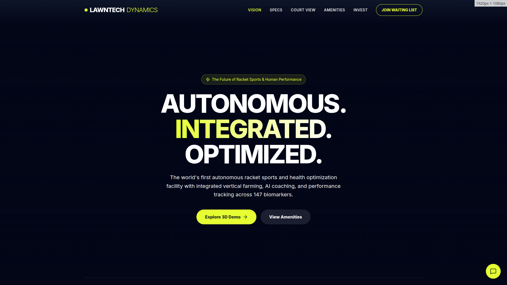

# Production Readiness Validation Report

**Generated**: 2025-11-23T06:17:07.010Z
**Status**: ❌ NO-GO

## Test Results Summary

| Test | Result | Details |
|------|--------|---------|
| Loading Screen | ⚠️ | No loading screen detected |
| 3D Court Renders | ❌ | No 3D rendering detected |
| Camera Controls | ❌ | Controls not tested |
| Performance | ❌ | FPS: 0.0 (min: 100.0, max: 0.0) |
| Memory Usage | ❌ | Initial: 0MB → Final: 0MB |
| Console Errors | ❌ | 1 errors found |

## Performance Metrics

### Frame Rate
- **Average FPS**: 0.0
- **Minimum FPS**: 100.0
- **Maximum FPS**: 0.0
- **Target**: > 50 FPS
- **Status**: BELOW TARGET

### Memory Usage
- **Initial Heap**: 0 MB
- **Final Heap**: 0 MB
- **Memory Growth**: 0 MB
- **Target**: < 500 MB
- **Status**: EXCEEDS LIMIT

## Console Output Analysis

### Errors (1)
- Failed to load resource: the server responded with a status of 404 (Not Found)

### Warnings (0)
No warnings detected ✅

## Screenshots
- 

## Production Readiness Decision

### ✅ PASSING CRITERIA
- [ ] 3D court renders successfully
- [ ] Performance meets minimum requirements (>50 FPS)
- [ ] Memory usage within limits (<500MB)
- [ ] No console errors
- [ ] User interactions functional

### 🎯 FINAL DECISION: NOT READY FOR PRODUCTION

## Required Fixes Before Production

1. **Critical**: 3D rendering not working - investigate WebGL initialization

2. **Critical**: Performance below acceptable threshold - optimize rendering

3. **Critical**: Memory usage too high - check for memory leaks

4. **Critical**: Console errors present - fix all errors

5. **Important**: Camera controls not working - fix user interaction

## Recommendations

### Before Re-validation
1. Fix all critical issues listed above
2. Run unit tests to ensure no regressions
3. Perform code review of changes
4. Re-run this validation suite

## Manual Testing Checklist

The following should be manually verified:
- [ ] All navigation links work
- [ ] Responsive design on mobile devices
- [ ] Cross-browser compatibility (Chrome, Firefox, Safari)
- [ ] Network error handling
- [ ] Accessibility features (keyboard navigation, screen readers)

---
*This report was generated automatically by the Production Validation Suite*
