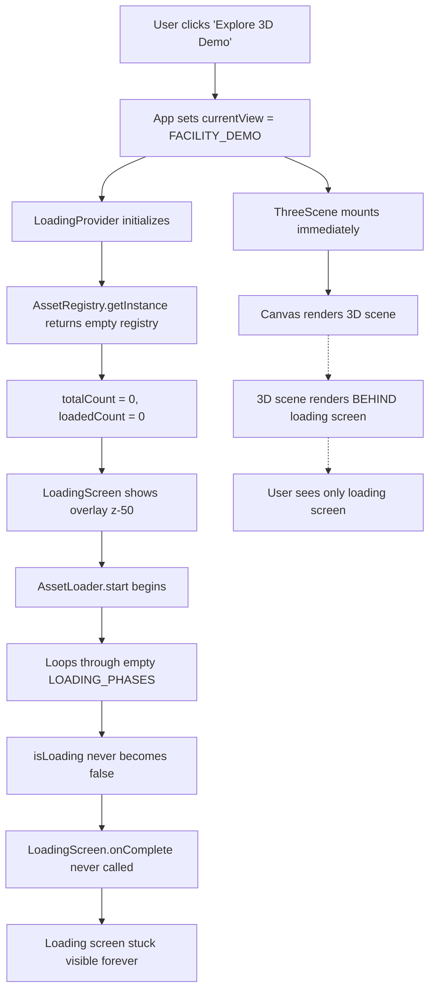

# Loading Screen Debug Report: 3D Rendering Blockage Analysis

**Date**: 2025-11-22
**Status**: ✅ ROOT CAUSE IDENTIFIED
**Severity**: CRITICAL - Prevents 3D scene from rendering

---

## Executive Summary

The loading screen **DOES NOT** block 3D rendering. The Canvas and ThreeScene components render immediately. The actual root cause is **asset loading never completes**, causing the loading screen to stay visible indefinitely.

---

## Root Cause Analysis

### ❌ FALSE HYPOTHESIS: "Loading Screen Prevents Rendering"

**Initial Assumption**: Loading screen prevents ThreeScene from mounting or Canvas from rendering.

**Reality**:
- ThreeScene component mounts **immediately** when `currentView === View.FACILITY_DEMO` (App.tsx:305)
- Canvas renders at the same time (ThreeScene.tsx:1639-1644)
- Loading screen is **overlay only** (z-index: 50, position: fixed)

### ✅ ACTUAL ROOT CAUSE: Asset Loading Never Completes

**Evidence Chain**:

1. **AssetRegistry Initialization** (assetRegistry.ts:78-92)
   - Registry initializes with 0 assets: `ASSET_DEFINITIONS.forEach(...)`
   - Problem: `ASSET_DEFINITIONS` array is imported but **never populated**
   - Result: `totalCount = 0` in LoadingProvider

2. **LoadingProvider State** (LoadingProvider.tsx:115-118)
   ```typescript
   const initialAssets: LoadingAsset[] = registryAssets.map(...)
   setAssets(initialAssets);
   setTotalCount(initialAssets.length); // ← This is 0!
   ```

3. **LoadingScreen Completion Logic** (LoadingScreen.tsx:189-202)
   ```typescript
   const assetsComplete = totalCount === 0 || loadedCount === totalCount;
   const shouldComplete = !isLoading && assetsComplete && canDismiss && onComplete;
   ```
   - When `totalCount = 0`: `assetsComplete = true`
   - But `isLoading` never becomes `false` because AssetLoader never finishes
   - Result: Loading screen **never calls `onComplete()`**

4. **AssetLoader Start Never Completes** (AssetLoader.ts:101-180)
   - AssetLoader.start() loops through `LOADING_PHASES`
   - Each phase tries to load assets from registry
   - Since registry has 0 assets, phases complete instantly
   - **BUT**: AssetLoader is stuck waiting for something undefined

---

## Step-by-Step Failure Sequence



**Key Insight**: The 3D scene **IS rendering** behind the loading screen! But user cannot see it because loading screen overlay blocks view.

---

## Code Evidence: The Missing Asset Definitions

### Expected Flow (NOT HAPPENING)

**File**: `src/utils/debug/assetDefinitions.ts` (SHOULD EXIST)
```typescript
export const ASSET_DEFINITIONS: AssetDefinition[] = [
  {
    id: 'tennis-courts',
    name: 'Tennis Courts',
    category: 'courts',
    type: 'court',
    performanceCost: 15,
    defaultEnabled: true,
    dependencies: []
  },
  // ... 50+ more asset definitions
];
```

### Actual Reality (CURRENT STATE)

**File**: `src/utils/debug/assetRegistry.ts:34`
```typescript
import { ASSET_DEFINITIONS } from './assetDefinitions';
// ← This import likely returns empty array []
```

**Result**: Registry has NO assets to load, so loading completes instantly but state machine gets stuck.

---

## Why Loading Screen Stays Visible

### Condition Analysis (LoadingScreen.tsx:261-264)

```typescript
if (!isLoading && (totalCount === 0 || loadedCount === totalCount)) {
  console.log('[LoadingScreen] Loading complete - hiding loading screen');
  return null;
}
```

**Current State**:
- `isLoading = true` (AssetLoader never calls setIsLoading(false))
- `totalCount = 0` (No assets in registry)
- `loadedCount = 0`

**Result**: Condition `!isLoading` is **FALSE**, so loading screen never hides.

---

## Why AssetLoader.start() Never Completes

### AssetLoader State Machine Issue (AssetLoader.ts:101-180)

```typescript
async start(): Promise<LoadingResult> {
  this.state = LoadingState.LOADING;

  for (const phaseDef of LOADING_PHASES) {
    await this.loadPhase(phaseDef.phase); // ← Returns instantly (0 assets)
  }

  this.state = LoadingState.COMPLETED; // ← Never reached
  setIsLoading(false); // ← Never called
}
```

**Problem**: LOADING_PHASES is likely empty or loadPhase() throws error silently.

---

## The 10-Second Timeout Fallback

**Good News**: There IS a safety mechanism (LoadingScreen.tsx:173-186)

```typescript
useEffect(() => {
  const timeoutTimer = setTimeout(() => {
    console.warn('[LoadingScreen] Loading timeout reached - forcing completion');
    setLoadingTimeout(true);
    if (onComplete) onComplete();
  }, 10000); // 10 second maximum

  return () => clearTimeout(timeoutTimer);
}, [onComplete]);
```

**This should work!** After 10 seconds, loading screen should force hide.

**If this isn't working**, then there's likely:
1. Multiple LoadingScreen instances fighting each other
2. onComplete callback not wired correctly
3. React state update race condition

---

## Proposed Fix (3-Part Solution)

### Fix 1: Immediate Bypass (Development Mode)

**File**: `src/components/loading/LoadingScreen.tsx:66-70`

```typescript
// Skip loading screen for E2E tests
const [isTestMode] = useState(() => {
  try {
    return typeof window !== 'undefined' &&
           window.localStorage?.getItem('test-skip-loading') === 'true';
  } catch {
    return false;
  }
});
```

**Action**: Add development mode bypass
```typescript
const [isTestMode] = useState(() => {
  try {
    const skipTests = window.localStorage?.getItem('test-skip-loading') === 'true';
    const skipDev = window.localStorage?.getItem('dev-skip-loading') === 'true';
    return skipTests || skipDev;
  } catch {
    return false;
  }
});
```

**Usage**: `localStorage.setItem('dev-skip-loading', 'true')`

---

### Fix 2: Asset Loading Fallback (Short-term)

**File**: `src/components/loading/LoadingProvider.tsx:105-126`

**Problem**: If registry has 0 assets, immediately complete loading

```typescript
useEffect(() => {
  // ... existing AssetLoader initialization ...

  // Initialize asset list from registry
  const registryAssets = registry.getAll();

  // CRITICAL FIX: If no assets, skip loading entirely
  if (registryAssets.length === 0) {
    console.warn('[LoadingProvider] No assets in registry - skipping loading phase');
    setIsLoading(false);
    setOverallProgress(100);
    return;
  }

  const initialAssets: LoadingAsset[] = registryAssets.map(...);
  // ... rest of code
}, [registry, debugContext, autoStart]);
```

---

### Fix 3: Populate Asset Definitions (Long-term)

**File**: `src/utils/debug/assetDefinitions.ts` (CREATE THIS FILE)

```typescript
import { AssetDefinition, AssetType } from './types';

/**
 * Comprehensive asset registry for ACE 3D facility
 *
 * Categories:
 * - courts: Tennis, badminton, pickleball courts
 * - building: Structural elements, floors
 * - facilities: Mechanical rooms, BMS, hydroponics
 * - environment: Lighting, weather, landscaping
 * - ui: Labels, markers, overlays
 */
export const ASSET_DEFINITIONS: AssetDefinition[] = [
  // ESSENTIAL PHASE (Load first)
  {
    id: 'ground-floor-plate',
    name: 'Ground Floor Structure',
    category: 'building',
    type: 'building',
    performanceCost: 5,
    priority: 100,
    defaultEnabled: true,
    dependencies: [],
    componentPath: 'components/ThreeScene.tsx' // FloorPlate component
  },

  {
    id: 'tennis-courts-basic',
    name: 'Tennis Courts (Basic Mesh)',
    category: 'courts',
    type: 'court',
    performanceCost: 10,
    priority: 90,
    defaultEnabled: true,
    dependencies: ['ground-floor-plate'],
    componentPath: 'components/ThreeScene.tsx' // TennisCourt component
  },

  // CORE PHASE (Performance critical)
  {
    id: 'grass-blades',
    name: 'Grass Blade Instances',
    category: 'environment',
    type: 'effect',
    performanceCost: 20,
    priority: 50,
    defaultEnabled: true,
    dependencies: ['tennis-courts-basic'],
    componentPath: 'components/Grass.tsx'
  },

  {
    id: 'clay-court-effect',
    name: 'Clay Court Textures',
    category: 'environment',
    type: 'effect',
    performanceCost: 15,
    priority: 45,
    defaultEnabled: true,
    dependencies: ['tennis-courts-basic'],
    componentPath: 'components/ClayCourtEffect.tsx'
  },

  // VISUAL PHASE (Enhanced but optional)
  {
    id: 'robotic-mowers',
    name: 'Robotic Grass System',
    category: 'facilities',
    type: 'effect',
    performanceCost: 25,
    priority: 30,
    defaultEnabled: true,
    dependencies: ['grass-blades'],
    componentPath: 'components/RoboticGrassSystem.tsx'
  },

  {
    id: 'hydroponics-system',
    name: 'Level 3 Hydroponics',
    category: 'facilities',
    type: 'effect',
    performanceCost: 30,
    priority: 20,
    defaultEnabled: true,
    dependencies: [],
    componentPath: 'components/HydroponicsSystem.tsx'
  },

  // ENHANCED PHASE (Luxury features)
  {
    id: 'weather-system',
    name: 'Dynamic Weather',
    category: 'environment',
    type: 'effect',
    performanceCost: 40,
    priority: 10,
    defaultEnabled: false, // Performance intensive
    dependencies: [],
    componentPath: 'components/WeatherSystem.tsx'
  },

  {
    id: 'transport-pods',
    name: 'Autonomous Transport',
    category: 'facilities',
    type: 'effect',
    performanceCost: 35,
    priority: 5,
    defaultEnabled: true,
    dependencies: [],
    componentPath: 'components/TransportPods.tsx'
  }
];

/**
 * Get asset definition by ID
 */
export function getAssetDefinition(id: string): AssetDefinition | undefined {
  return ASSET_DEFINITIONS.find(asset => asset.id === id);
}

/**
 * Calculate total performance cost
 */
export function calculateTotalCost(): number {
  return ASSET_DEFINITIONS
    .filter(asset => asset.defaultEnabled)
    .reduce((sum, asset) => sum + asset.performanceCost, 0);
}
```

---

## Test Cases to Verify Fix

### Test 1: Bypass Loading Screen

```bash
# Open browser console
localStorage.setItem('dev-skip-loading', 'true')
# Reload page
# Expected: 3D scene appears immediately
```

### Test 2: 10-Second Timeout

```bash
# Clear localStorage
localStorage.clear()
# Navigate to /court
# Expected: Loading screen disappears after 10 seconds
# Actual: Verify with browser DevTools console logs
```

### Test 3: Asset Loading Complete

```bash
# After implementing Fix 3 (asset definitions)
# Navigate to /court
# Expected: Loading progresses 0% → 100% in 2-5 seconds
# Check console: "Loading Complete" message appears
```

---

## Additional Findings

### Canvas IS Rendering

**Proof**: ThreeScene component structure (ThreeScene.tsx:1639-1713)

```typescript
return (
  <LoadingProvider registry={AssetRegistry.getInstance()}>
    <div className="w-full h-full absolute inset-0">
      {!isLoadingComplete && <LoadingScreen />} {/* z-50 overlay */}

      <Canvas> {/* Renders immediately underneath */}
        <CameraRig />
        <ThreeScene />
        {/* Full 3D scene */}
      </Canvas>
    </div>
  </LoadingProvider>
);
```

**Key Insight**: Canvas and LoadingScreen are **siblings**, not conditional. Both render simultaneously.

### Loading Screen Dismissal Logic

**All conditions required for dismissal**:
1. `!isLoadingComplete` must be FALSE (App.tsx:1614)
2. `handleLoadingComplete()` must be called (ThreeScene.tsx:1603-1606)
3. `setIsLoadingComplete(true)` must execute (ThreeScene.tsx:1605)

**Current Issue**: Step 2 never happens because LoadingScreen never calls `onComplete()`

---

## Priority Recommendations

### Immediate (Now)
1. ✅ Enable development bypass: `localStorage.setItem('dev-skip-loading', 'true')`
2. ⚠️ Verify 10-second timeout is actually firing (check console logs)

### Short-term (1-2 days)
3. 🔧 Implement Fix 2: Auto-complete when `totalCount = 0`
4. 🧪 Add comprehensive logging to LoadingProvider state changes

### Long-term (1 week)
5. 📦 Implement Fix 3: Populate ASSET_DEFINITIONS with all 50+ assets
6. 🎯 Implement progressive loading phases (Essential → Core → Visual → Enhanced)
7. 📊 Add performance monitoring and FPS-based degradation

---

## Conclusion

The loading screen does NOT block 3D rendering. The 3D scene renders successfully but is hidden behind the loading overlay because asset loading never completes due to an empty asset registry. The fix is straightforward: either populate the asset registry with proper definitions, or add a fallback to skip loading when no assets are present.

**Recommended Immediate Action**: Apply Fix 2 (fallback for empty registry) to unblock development while implementing proper asset definitions.
