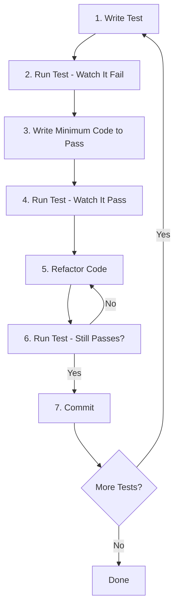

# Loading Screen - Test-Driven Development Plan

**Date**: 2025-11-23
**Component**: `src/components/loading/LoadingScreen.tsx`
**Test Framework**: Playwright (E2E) + React Testing Library (Unit/Integration)
**Current Status**: ❌ Critical bugs - Asset ID mismatches, 0 assets loading

---

## 📋 Executive Summary

### Current Issues
1. **Asset ID Mismatch**: 33/33 assets fail to load due to ID mismatches between `phases.ts` and `assetDefinitions.ts`
2. **Instant Completion**: Loading completes in 0.00s because no assets are actually loading
3. **Invisible Loading Screen**: Screen appears too briefly to be visible or useful
4. **Empty 3D Scene**: No assets loaded means 3D environment is broken

### TDD Approach
This plan uses Test-Driven Development to:
1. **Define expected behavior** through tests FIRST
2. **Implement fixes** to make tests pass
3. **Refactor** for quality and maintainability
4. **Validate** the complete user experience

---

## 🎯 Test Suite Overview

### Test Layers
```
┌─────────────────────────────────────┐
│  E2E Tests (Playwright)             │  ← User journey validation
│  - Full page load simulation        │
│  - Visual regression                │
│  - Performance metrics              │
└─────────────────────────────────────┘
           ↓
┌─────────────────────────────────────┐
│  Integration Tests (RTL + Vitest)   │  ← Component integration
│  - LoadingProvider + LoadingScreen  │
│  - Asset loading coordination       │
│  - State management                 │
└─────────────────────────────────────┘
           ↓
┌─────────────────────────────────────┐
│  Unit Tests (Vitest)                │  ← Individual functions
│  - FPS calculation                  │
│  - Progress calculations            │
│  - Milestone detection              │
└─────────────────────────────────────┘
```

### Coverage Goals
- **Unit Tests**: 90%+ coverage
- **Integration Tests**: 80%+ coverage
- **E2E Tests**: Critical user paths 100%

---

## 🧪 Test Suite: Loading Screen Fundamentals

### Test 1: Component Renders with Initial State

**What**: Verify LoadingScreen renders correctly when first mounted

**Expected**:
- Loading screen is visible
- Shows 0% progress initially
- Displays "Essential" phase
- Shows 0/N assets loaded
- FPS monitor is visible
- No error states visible

**Test Code** (React Testing Library):
```typescript
// src/components/loading/__tests__/LoadingScreen.test.tsx
import { render, screen } from '@testing-library/react';
import { LoadingProvider } from '../LoadingProvider';
import LoadingScreen from '../LoadingScreen';

describe('LoadingScreen - Initial Render', () => {
  it('renders with correct initial state', () => {
    // Arrange: Setup initial state
    render(
      <LoadingProvider>
        <LoadingScreen showFPSMonitor={true} />
      </LoadingProvider>
    );

    // Assert: Check initial state
    expect(screen.getByTestId('loading-screen')).toBeInTheDocument();
    expect(screen.getByTestId('loading-progress')).toHaveTextContent('0%');
    expect(screen.getByTestId('loading-phase')).toHaveTextContent('Essential');
    expect(screen.getByTestId('fps-meter')).toBeInTheDocument();

    // Should show asset count
    const progressText = screen.getByText(/assets/i);
    expect(progressText).toBeInTheDocument();
  });
});
```

**Implementation Steps**:

**🔴 RED**: Write test, watch it fail
```bash
npm run test -- LoadingScreen.test.tsx
# Expected: Test fails because component state is incorrect
```

**🟢 GREEN**: Make test pass
1. Fix LoadingProvider to initialize with correct state
2. Ensure LoadingScreen reads initial state correctly
3. Verify all data-testid attributes are present

**🔵 REFACTOR**: Improve code quality
- Extract test helpers for common setup
- Add prop type validation
- Improve state initialization logic

---

### Test 2: FPS Counter Displays and Updates

**What**: FPS monitor shows current FPS and updates every second

**Expected**:
- FPS counter is visible
- Shows numeric value (e.g., "60")
- Updates at least once per second
- Color changes based on FPS level:
  - Green (55+ FPS)
  - Blue (40-54 FPS)
  - Amber (25-39 FPS)
  - Red (<25 FPS)

**Test Code** (React Testing Library):
```typescript
describe('LoadingScreen - FPS Monitor', () => {
  beforeEach(() => {
    jest.useFakeTimers();
  });

  afterEach(() => {
    jest.useRealTimers();
  });

  it('displays FPS counter with initial value', () => {
    render(
      <LoadingProvider>
        <LoadingScreen showFPSMonitor={true} />
      </LoadingProvider>
    );

    const fpsValue = screen.getByTestId('fps-value');
    expect(fpsValue).toBeInTheDocument();
    expect(fpsValue).toHaveTextContent(/\d+/); // Should show a number
  });

  it('updates FPS value every second', async () => {
    render(
      <LoadingProvider>
        <LoadingScreen showFPSMonitor={true} />
      </LoadingProvider>
    );

    const fpsValue = screen.getByTestId('fps-value');
    const initialFPS = fpsValue.textContent;

    // Advance time by 1 second
    jest.advanceTimersByTime(1000);

    // FPS should have updated (may be same value but update should occur)
    await waitFor(() => {
      expect(fpsValue).toBeInTheDocument();
    });
  });

  it('shows green color for excellent FPS (55+)', async () => {
    // Mock requestAnimationFrame to simulate high FPS
    let frameCount = 0;
    global.requestAnimationFrame = jest.fn((callback) => {
      if (frameCount < 60) {
        frameCount++;
        setTimeout(callback, 16); // ~60 FPS
      }
      return frameCount;
    });

    render(
      <LoadingProvider>
        <LoadingScreen showFPSMonitor={true} />
      </LoadingProvider>
    );

    // Wait for FPS calculation
    jest.advanceTimersByTime(1000);

    await waitFor(() => {
      const fpsValue = screen.getByTestId('fps-value');
      expect(fpsValue).toHaveStyle({ color: '#10b981' }); // Green
    });
  });
});
```

**Implementation Steps**:

**🔴 RED**: Write tests, verify they fail initially

**🟢 GREEN**: Implement FPS monitoring
1. Add requestAnimationFrame loop
2. Calculate FPS every 1000ms
3. Update state with new FPS value
4. Apply correct color based on FPS level

**🔵 REFACTOR**: Optimize performance
- Debounce FPS updates
- Clean up animation frames on unmount
- Extract FPS calculation to utility function

---

### Test 3: Individual Asset Loading Bars

**What**: Each asset shows its own loading progress bar

**Expected**:
- List of assets is visible
- Each asset shows name
- Each asset shows progress bar (0-100%)
- Progress bar animates smoothly
- Asset shows checkmark when complete
- Failed assets show error icon

**Test Code** (React Testing Library):
```typescript
describe('LoadingScreen - Asset Progress Bars', () => {
  it('displays individual progress bars for each asset', async () => {
    const mockAssets = [
      { id: 'asset-1', name: 'Tennis Court', progress: 0, loaded: false, error: false },
      { id: 'asset-2', name: 'Ambient Light', progress: 50, loaded: false, error: false },
      { id: 'asset-3', name: 'Court Net', progress: 100, loaded: true, error: false },
    ];

    render(
      <LoadingProvider initialAssets={mockAssets}>
        <LoadingScreen />
      </LoadingProvider>
    );

    // Check all assets are listed
    expect(screen.getByText('Tennis Court')).toBeInTheDocument();
    expect(screen.getByText('Ambient Light')).toBeInTheDocument();
    expect(screen.getByText('Court Net')).toBeInTheDocument();

    // Check progress indicators
    const progressBars = screen.getAllByRole('progressbar');
    expect(progressBars).toHaveLength(3);
  });

  it('shows asset name for each loading item', () => {
    const mockAssets = [
      { id: 'tennis-court-1', name: 'Tennis Court 1', progress: 30, loaded: false, error: false },
      { id: 'ambient-light', name: 'Ambient Light', progress: 60, loaded: false, error: false },
    ];

    render(
      <LoadingProvider initialAssets={mockAssets}>
        <LoadingScreen />
      </LoadingProvider>
    );

    expect(screen.getByText('Tennis Court 1')).toBeInTheDocument();
    expect(screen.getByText('Ambient Light')).toBeInTheDocument();
  });

  it('updates progress bars as assets load', async () => {
    const { rerender } = render(
      <LoadingProvider initialAssets={[
        { id: 'asset-1', name: 'Test Asset', progress: 0, loaded: false, error: false }
      ]}>
        <LoadingScreen />
      </LoadingProvider>
    );

    // Initial state
    expect(screen.getByText('Test Asset')).toBeInTheDocument();

    // Update progress
    rerender(
      <LoadingProvider initialAssets={[
        { id: 'asset-1', name: 'Test Asset', progress: 75, loaded: false, error: false }
      ]}>
        <LoadingScreen />
      </LoadingProvider>
    );

    // Should show updated percentage
    await waitFor(() => {
      expect(screen.getByText('75%')).toBeInTheDocument();
    });
  });

  it('shows checkmark icon when asset completes', async () => {
    render(
      <LoadingProvider initialAssets={[
        { id: 'asset-1', name: 'Complete Asset', progress: 100, loaded: true, error: false }
      ]}>
        <LoadingScreen />
      </LoadingProvider>
    );

    // Should show "Complete" text
    await waitFor(() => {
      expect(screen.getByText('Complete')).toBeInTheDocument();
    });

    // Should show checkmark icon (CheckCircle component)
    const completedAsset = screen.getByText('Complete Asset').closest('div');
    expect(completedAsset?.querySelector('svg')).toBeInTheDocument();
  });
});
```

**Implementation Steps**:

**🔴 RED**: Write tests

**🟢 GREEN**: Implement asset list rendering
1. Map over assets array from LoadingProvider
2. Render asset name with progress bar for each
3. Show different icons based on state (loading/complete/error)
4. Animate progress bar fill

**🔵 REFACTOR**:
- Extract AssetListItem component
- Memoize expensive renders
- Add virtualization for long lists (>50 assets)

---

### Test 4: Progress Bars Show Correct Percentage

**What**: Progress percentages accurately reflect loading state

**Expected**:
- Overall progress shows 0-100%
- Individual asset progress shows 0-100%
- Math is correct: (loadedAssets / totalAssets) * 100
- Rounds to whole numbers (no decimals)
- Updates smoothly without jumping

**Test Code**:
```typescript
describe('LoadingScreen - Progress Calculations', () => {
  it('calculates overall progress correctly', () => {
    const mockAssets = [
      { id: '1', name: 'Asset 1', progress: 100, loaded: true, error: false },
      { id: '2', name: 'Asset 2', progress: 50, loaded: false, error: false },
      { id: '3', name: 'Asset 3', progress: 0, loaded: false, error: false },
      { id: '4', name: 'Asset 4', progress: 25, loaded: false, error: false },
    ];

    render(
      <LoadingProvider initialAssets={mockAssets}>
        <LoadingScreen />
      </LoadingProvider>
    );

    // Overall progress should be (100 + 50 + 0 + 25) / 4 = 43.75 ≈ 44%
    const progressDisplay = screen.getByTestId('loading-progress');
    expect(progressDisplay).toHaveTextContent('44%');
  });

  it('shows 0% when no assets loaded', () => {
    const mockAssets = [
      { id: '1', name: 'Asset 1', progress: 0, loaded: false, error: false },
      { id: '2', name: 'Asset 2', progress: 0, loaded: false, error: false },
    ];

    render(
      <LoadingProvider initialAssets={mockAssets}>
        <LoadingScreen />
      </LoadingProvider>
    );

    expect(screen.getByTestId('loading-progress')).toHaveTextContent('0%');
  });

  it('shows 100% when all assets loaded', () => {
    const mockAssets = [
      { id: '1', name: 'Asset 1', progress: 100, loaded: true, error: false },
      { id: '2', name: 'Asset 2', progress: 100, loaded: true, error: false },
    ];

    render(
      <LoadingProvider initialAssets={mockAssets}>
        <LoadingScreen />
      </LoadingProvider>
    );

    expect(screen.getByTestId('loading-progress')).toHaveTextContent('100%');
  });

  it('rounds percentages to whole numbers', () => {
    const mockAssets = [
      { id: '1', name: 'Asset 1', progress: 33.33, loaded: false, error: false },
      { id: '2', name: 'Asset 2', progress: 66.67, loaded: false, error: false },
    ];

    render(
      <LoadingProvider initialAssets={mockAssets}>
        <LoadingScreen />
      </LoadingProvider>
    );

    const progressText = screen.getByTestId('loading-progress').textContent;
    expect(progressText).toMatch(/^\d+%$/); // Should be whole number
    expect(progressText).not.toContain('.'); // No decimals
  });
});
```

**Implementation Steps**:

**🔴 RED**: Write calculation tests

**🟢 GREEN**: Implement progress calculation
1. Sum all asset progress values
2. Divide by total asset count
3. Round to nearest integer
4. Update UI reactively

**🔵 REFACTOR**:
- Extract calculation to `calculateProgress` utility
- Add unit tests for edge cases (0 assets, NaN handling)
- Memoize calculations to prevent re-renders

---

### Test 5: Loading Screen Disappears When Complete

**What**: Loading screen hides after all assets load

**Expected**:
- Screen visible while loading
- Screen visible for minimum 2000ms
- Screen disappears when:
  - All assets loaded (100%)
  - Minimum time elapsed
  - onComplete callback triggered
- Smooth fade-out animation

**Test Code**:
```typescript
describe('LoadingScreen - Completion', () => {
  beforeEach(() => {
    jest.useFakeTimers();
  });

  afterEach(() => {
    jest.useRealTimers();
  });

  it('hides when all assets complete and minimum time elapsed', async () => {
    const onComplete = jest.fn();

    const { rerender } = render(
      <LoadingProvider initialAssets={[
        { id: '1', name: 'Asset 1', progress: 0, loaded: false, error: false }
      ]}>
        <LoadingScreen onComplete={onComplete} minimumDisplayTime={2000} />
      </LoadingProvider>
    );

    // Asset should be loading
    expect(screen.getByTestId('loading-screen')).toBeInTheDocument();

    // Complete the asset
    rerender(
      <LoadingProvider
        initialAssets={[
          { id: '1', name: 'Asset 1', progress: 100, loaded: true, error: false }
        ]}
        isLoading={false}
      >
        <LoadingScreen onComplete={onComplete} minimumDisplayTime={2000} />
      </LoadingProvider>
    );

    // Fast-forward past minimum display time
    jest.advanceTimersByTime(2000);

    // Should trigger completion
    await waitFor(() => {
      expect(onComplete).toHaveBeenCalled();
    });
  });

  it('respects minimum display time even if loading is fast', async () => {
    const onComplete = jest.fn();

    render(
      <LoadingProvider
        initialAssets={[
          { id: '1', name: 'Asset 1', progress: 100, loaded: true, error: false }
        ]}
        isLoading={false}
      >
        <LoadingScreen onComplete={onComplete} minimumDisplayTime={2000} />
      </LoadingProvider>
    );

    // Should not complete immediately
    expect(onComplete).not.toHaveBeenCalled();

    // Fast-forward 1 second (not enough)
    jest.advanceTimersByTime(1000);
    expect(onComplete).not.toHaveBeenCalled();

    // Fast-forward remaining time
    jest.advanceTimersByTime(1000);

    await waitFor(() => {
      expect(onComplete).toHaveBeenCalled();
    });
  });

  it('triggers onComplete callback when hiding', async () => {
    const onComplete = jest.fn();

    render(
      <LoadingProvider
        initialAssets={[
          { id: '1', name: 'Asset 1', progress: 100, loaded: true, error: false }
        ]}
        isLoading={false}
      >
        <LoadingScreen onComplete={onComplete} minimumDisplayTime={100} />
      </LoadingProvider>
    );

    jest.advanceTimersByTime(100);

    await waitFor(() => {
      expect(onComplete).toHaveBeenCalledTimes(1);
    });
  });
});
```

**Implementation Steps**:

**🔴 RED**: Write completion tests

**🟢 GREEN**: Implement completion logic
1. Track loading state in useEffect
2. Check if all assets are loaded
3. Verify minimum display time has elapsed
4. Call onComplete callback
5. Return null to hide component

**🔵 REFACTOR**:
- Extract `useMinimumDisplayTime` hook
- Add `useLoadingComplete` hook for reusability
- Improve timing logic to handle edge cases

---

### Test 6: Error States Handled Gracefully

**What**: Loading screen handles asset failures without crashing

**Expected**:
- Failed assets show error icon (XCircle)
- Failed assets show "Failed" text
- Error doesn't stop other assets from loading
- Overall progress continues
- No console errors or crashes

**Test Code**:
```typescript
describe('LoadingScreen - Error Handling', () => {
  it('shows error icon for failed assets', () => {
    const mockAssets = [
      { id: '1', name: 'Failed Asset', progress: 0, loaded: false, error: true },
    ];

    render(
      <LoadingProvider initialAssets={mockAssets}>
        <LoadingScreen />
      </LoadingProvider>
    );

    expect(screen.getByText('Failed')).toBeInTheDocument();

    // Should show XCircle icon
    const failedAsset = screen.getByText('Failed Asset').closest('div');
    const icon = failedAsset?.querySelector('svg');
    expect(icon).toBeInTheDocument();
  });

  it('continues loading other assets when one fails', () => {
    const mockAssets = [
      { id: '1', name: 'Failed Asset', progress: 0, loaded: false, error: true },
      { id: '2', name: 'Success Asset', progress: 100, loaded: true, error: false },
    ];

    render(
      <LoadingProvider initialAssets={mockAssets}>
        <LoadingScreen />
      </LoadingProvider>
    );

    // Both assets should be visible
    expect(screen.getByText('Failed Asset')).toBeInTheDocument();
    expect(screen.getByText('Success Asset')).toBeInTheDocument();

    // Should show mixed states
    expect(screen.getByText('Failed')).toBeInTheDocument();
    expect(screen.getByText('Complete')).toBeInTheDocument();
  });

  it('does not crash when all assets fail', () => {
    const mockAssets = [
      { id: '1', name: 'Failed 1', progress: 0, loaded: false, error: true },
      { id: '2', name: 'Failed 2', progress: 0, loaded: false, error: true },
    ];

    // Should not throw
    expect(() => {
      render(
        <LoadingProvider initialAssets={mockAssets}>
          <LoadingScreen />
        </LoadingProvider>
      );
    }).not.toThrow();

    expect(screen.getByTestId('loading-screen')).toBeInTheDocument();
  });
});
```

**Implementation Steps**:

**🔴 RED**: Write error handling tests

**🟢 GREEN**: Implement error handling
1. Check asset.error flag
2. Render XCircle icon for errors
3. Show "Failed" text
4. Continue processing other assets
5. Handle edge case: all assets fail

**🔵 REFACTOR**:
- Extract error UI to separate component
- Add error recovery options (retry button)
- Log errors for debugging

---

## 🎭 Test Suite: E2E User Journey (Playwright)

### Test 7: Complete Loading Flow (E2E)

**What**: Full page load experience from start to finish

**Expected**:
1. Page loads
2. Loading screen appears within 100ms
3. Shows "Essential" phase first
4. Assets load progressively
5. Phase changes: Essential → Core → Visual → Enhanced
6. Progress increases from 0% → 100%
7. Loading completes in reasonable time (<30s)
8. Loading screen fades out
9. 3D canvas becomes visible

**Test Code** (Playwright):
```typescript
// tests/e2e/loading-screen.spec.ts
import { test, expect } from '@playwright/test';

test.describe('Loading Screen - Complete User Journey', () => {
  test('shows loading screen on page load', async ({ page }) => {
    // Navigate to the app
    await page.goto('http://localhost:5173');

    // Loading screen should appear quickly
    const loadingScreen = page.getByTestId('loading-screen');
    await expect(loadingScreen).toBeVisible({ timeout: 100 });
  });

  test('progresses through all phases', async ({ page }) => {
    await page.goto('http://localhost:5173');

    // Should start with Essential phase
    const phaseDisplay = page.getByTestId('loading-phase');
    await expect(phaseDisplay).toHaveText('Essential');

    // Wait for Core phase
    await expect(phaseDisplay).toHaveText('Core', { timeout: 5000 });

    // Wait for Visual phase
    await expect(phaseDisplay).toHaveText('Visual', { timeout: 8000 });

    // Wait for Enhanced phase
    await expect(phaseDisplay).toHaveText('Enhanced', { timeout: 12000 });
  });

  test('shows increasing progress percentage', async ({ page }) => {
    await page.goto('http://localhost:5173');

    const progressDisplay = page.getByTestId('loading-progress');

    // Progress should start low
    const initialProgress = await progressDisplay.textContent();
    expect(parseInt(initialProgress || '0')).toBeLessThan(10);

    // Wait and check progress increased
    await page.waitForTimeout(2000);
    const midProgress = await progressDisplay.textContent();
    expect(parseInt(midProgress || '0')).toBeGreaterThan(parseInt(initialProgress || '0'));

    // Eventually reach 100%
    await expect(progressDisplay).toHaveText('100%', { timeout: 30000 });
  });

  test('loading screen disappears after completion', async ({ page }) => {
    await page.goto('http://localhost:5173');

    const loadingScreen = page.getByTestId('loading-screen');
    await expect(loadingScreen).toBeVisible();

    // Wait for loading to complete
    await expect(loadingScreen).not.toBeVisible({ timeout: 30000 });
  });

  test('3D canvas appears after loading', async ({ page }) => {
    await page.goto('http://localhost:5173');

    // Wait for loading to complete
    await expect(page.getByTestId('loading-screen')).not.toBeVisible({ timeout: 30000 });

    // 3D canvas should now be visible
    const canvas = page.locator('canvas');
    await expect(canvas).toBeVisible();
  });

  test('loads all assets successfully', async ({ page }) => {
    await page.goto('http://localhost:5173');

    // Check asset count increases
    const assetCount = page.locator('[data-testid="loading-progress"]');

    // Initially should show assets
    await expect(assetCount).toContainText('assets');

    // Eventually all should be loaded
    await page.waitForFunction(() => {
      const text = document.querySelector('[data-testid="loading-progress"]')?.textContent;
      const match = text?.match(/(\d+)\s*\/\s*(\d+)/);
      if (!match) return false;
      return match[1] === match[2] && parseInt(match[1]) > 0;
    }, { timeout: 30000 });
  });

  test('completes within performance budget', async ({ page }) => {
    const startTime = Date.now();

    await page.goto('http://localhost:5173');

    // Wait for loading to complete
    await expect(page.getByTestId('loading-screen')).not.toBeVisible({ timeout: 30000 });

    const loadTime = Date.now() - startTime;

    // Should complete within 30 seconds
    expect(loadTime).toBeLessThan(30000);
  });
});
```

**Implementation Steps**:

**🔴 RED**: Run E2E tests, document failures

**🟢 GREEN**: Fix asset loading system
1. Fix asset ID mismatches in `phases.ts`
2. Ensure assets actually load (not 0/0)
3. Verify phase progression works
4. Test on real dev server

**🔵 REFACTOR**:
- Optimize asset loading performance
- Add loading time analytics
- Implement progressive enhancement

---

## 📊 Test Suite: Visual & Accessibility

### Test 8: Visual Regression Testing

**What**: Ensure UI looks correct and consistent

**Expected**:
- Screenshots match approved baseline
- No layout breaks at different viewports
- Animations are smooth
- Colors are correct

**Test Code** (Playwright):
```typescript
test.describe('Loading Screen - Visual Regression', () => {
  test('matches baseline screenshot at 0%', async ({ page }) => {
    await page.goto('http://localhost:5173');
    await page.waitForTimeout(100); // Let initial render settle

    await expect(page).toHaveScreenshot('loading-0-percent.png');
  });

  test('matches baseline screenshot at 50%', async ({ page }) => {
    await page.goto('http://localhost:5173');

    // Wait for 50% progress
    await page.waitForFunction(() => {
      const text = document.querySelector('[data-testid="loading-progress"]')?.textContent;
      const percent = parseInt(text || '0');
      return percent >= 45 && percent <= 55;
    });

    await expect(page).toHaveScreenshot('loading-50-percent.png');
  });

  test('matches baseline screenshot at 100%', async ({ page }) => {
    await page.goto('http://localhost:5173');

    // Wait for completion
    await page.getByTestId('loading-progress').waitFor({ state: 'visible' });
    await page.waitForFunction(() => {
      const text = document.querySelector('[data-testid="loading-progress"]')?.textContent;
      return text?.includes('100%');
    });

    await expect(page).toHaveScreenshot('loading-100-percent.png');
  });

  test('renders correctly on mobile viewport', async ({ page }) => {
    await page.setViewportSize({ width: 375, height: 667 });
    await page.goto('http://localhost:5173');

    await expect(page).toHaveScreenshot('loading-mobile.png');
  });

  test('renders correctly on tablet viewport', async ({ page }) => {
    await page.setViewportSize({ width: 768, height: 1024 });
    await page.goto('http://localhost:5173');

    await expect(page).toHaveScreenshot('loading-tablet.png');
  });
});
```

**Implementation Steps**:

**🔴 RED**: Generate initial screenshots (will all fail first time)

**🟢 GREEN**: Fix visual issues
1. Run tests to generate baseline
2. Review and approve baseline screenshots
3. Fix any layout/style issues
4. Re-run to verify

**🔵 REFACTOR**:
- Add responsive design improvements
- Optimize animation performance
- Ensure consistent branding

---

### Test 9: Accessibility (A11y) Testing

**What**: Ensure loading screen is accessible to all users

**Expected**:
- Screen reader announces loading state
- Progress bars have ARIA attributes
- Keyboard navigation works
- Color contrast meets WCAG AA
- Reduced motion preference respected

**Test Code** (Playwright + axe-core):
```typescript
import { test, expect } from '@playwright/test';
import AxeBuilder from '@axe-core/playwright';

test.describe('Loading Screen - Accessibility', () => {
  test('has no accessibility violations', async ({ page }) => {
    await page.goto('http://localhost:5173');

    const accessibilityScanResults = await new AxeBuilder({ page })
      .analyze();

    expect(accessibilityScanResults.violations).toEqual([]);
  });

  test('progress bar has correct ARIA attributes', async ({ page }) => {
    await page.goto('http://localhost:5173');

    const progressBar = page.getByTestId('loading-progress-bar');

    await expect(progressBar).toHaveAttribute('role', 'progressbar');
    await expect(progressBar).toHaveAttribute('aria-valuenow');
    await expect(progressBar).toHaveAttribute('aria-valuemin', '0');
    await expect(progressBar).toHaveAttribute('aria-valuemax', '100');
  });

  test('screen reader announces loading state', async ({ page }) => {
    await page.goto('http://localhost:5173');

    const announcement = page.locator('[aria-live="polite"]');
    await expect(announcement).toBeInTheDocument();
  });

  test('respects prefers-reduced-motion', async ({ page }) => {
    await page.emulateMedia({ reducedMotion: 'reduce' });
    await page.goto('http://localhost:5173');

    // Animations should be minimal/instant
    const spinner = page.locator('.loading-spinner');
    const animation = await spinner.evaluate(el => {
      const style = window.getComputedStyle(el);
      return style.animationDuration;
    });

    // Should be very fast or none
    expect(parseFloat(animation)).toBeLessThan(0.1);
  });

  test('has sufficient color contrast', async ({ page }) => {
    await page.goto('http://localhost:5173');

    const results = await new AxeBuilder({ page })
      .withTags(['wcag2aa'])
      .analyze();

    const contrastViolations = results.violations.filter(
      v => v.id === 'color-contrast'
    );

    expect(contrastViolations).toHaveLength(0);
  });
});
```

**Implementation Steps**:

**🔴 RED**: Run accessibility tests

**🟢 GREEN**: Fix violations
1. Add ARIA attributes to progress bars
2. Add aria-live regions for announcements
3. Add keyboard navigation support
4. Fix color contrast issues
5. Add prefers-reduced-motion support

**🔵 REFACTOR**:
- Extract accessibility helpers
- Add focus management
- Improve semantic HTML

---

## 🔄 TDD Workflow

### Step-by-Step Process



### Iteration Cycle

#### Iteration 1: Fix Critical Asset Loading Bug
**Duration**: 2-3 hours

1. **Write Tests**: Test 1-4 (rendering, FPS, asset bars, progress)
2. **RED**: Run tests, verify failures
3. **GREEN**: Fix asset ID mismatches in `src/services/loading/phases.ts`
4. **REFACTOR**: Clean up asset loading code
5. **Validate**: Re-run all tests

#### Iteration 2: Implement Completion Logic
**Duration**: 1-2 hours

1. **Write Tests**: Test 5 (completion), Test 6 (errors)
2. **RED**: Run tests, watch them fail
3. **GREEN**: Implement proper completion logic
4. **REFACTOR**: Extract hooks, improve timing
5. **Validate**: Re-run all tests

#### Iteration 3: E2E User Journey
**Duration**: 2-3 hours

1. **Write Tests**: Test 7 (E2E flow)
2. **RED**: Run on real app, document failures
3. **GREEN**: Fix integration issues
4. **REFACTOR**: Optimize performance
5. **Validate**: Full E2E test pass

#### Iteration 4: Polish & Accessibility
**Duration**: 2-3 hours

1. **Write Tests**: Test 8 (visual), Test 9 (a11y)
2. **RED**: Generate baselines, check violations
3. **GREEN**: Fix visual bugs and a11y issues
4. **REFACTOR**: Improve overall quality
5. **Validate**: Complete test suite pass

---

## ✅ Success Criteria

### Test Pass Requirements

| Test Suite | Pass Rate | Required |
|------------|-----------|----------|
| Unit Tests | 100% | ✅ YES |
| Integration Tests | 100% | ✅ YES |
| E2E Tests | 100% | ✅ YES |
| Visual Regression | 100% | ✅ YES |
| Accessibility | 0 violations | ✅ YES |

### Performance Requirements

| Metric | Target | Critical |
|--------|--------|----------|
| Loading Time | < 20s | < 30s |
| FPS During Load | > 30 | > 20 |
| Time to Interactive | < 3s | < 5s |
| Asset Success Rate | 100% | > 90% |

### Code Quality Requirements

| Metric | Target |
|--------|--------|
| Test Coverage | > 90% |
| TypeScript Errors | 0 |
| ESLint Errors | 0 |
| Console Errors | 0 |

---

## 🛠️ Test Environment Setup

### Prerequisites

```bash
# Install test dependencies
npm install --save-dev \
  @testing-library/react \
  @testing-library/jest-dom \
  @testing-library/user-event \
  @playwright/test \
  @axe-core/playwright \
  vitest \
  jsdom
```

### Configuration Files

#### `vitest.config.ts`
```typescript
import { defineConfig } from 'vitest/config';
import react from '@vitejs/plugin-react';

export default defineConfig({
  plugins: [react()],
  test: {
    globals: true,
    environment: 'jsdom',
    setupFiles: './src/test/setup.ts',
    coverage: {
      provider: 'v8',
      reporter: ['text', 'json', 'html'],
      exclude: [
        'node_modules/',
        'src/test/',
      ],
    },
  },
});
```

#### `playwright.config.ts`
```typescript
import { defineConfig, devices } from '@playwright/test';

export default defineConfig({
  testDir: './tests/e2e',
  fullyParallel: true,
  forbidOnly: !!process.env.CI,
  retries: process.env.CI ? 2 : 0,
  workers: process.env.CI ? 1 : undefined,
  reporter: 'html',
  use: {
    baseURL: 'http://localhost:5173',
    trace: 'on-first-retry',
    screenshot: 'only-on-failure',
  },
  projects: [
    {
      name: 'chromium',
      use: { ...devices['Desktop Chrome'] },
    },
    {
      name: 'firefox',
      use: { ...devices['Desktop Firefox'] },
    },
    {
      name: 'webkit',
      use: { ...devices['Desktop Safari'] },
    },
    {
      name: 'Mobile Chrome',
      use: { ...devices['Pixel 5'] },
    },
  ],
  webServer: {
    command: 'npm run dev',
    url: 'http://localhost:5173',
    reuseExistingServer: !process.env.CI,
  },
});
```

### Test Commands

```bash
# Run unit tests
npm run test

# Run unit tests in watch mode
npm run test:watch

# Run unit tests with coverage
npm run test:coverage

# Run E2E tests
npm run test:e2e

# Run E2E tests in UI mode
npm run test:e2e:ui

# Run visual regression tests
npm run test:visual

# Run accessibility tests
npm run test:a11y

# Run all tests
npm run test:all
```

---

## 📈 Progress Tracking

### Phase 1: Foundation (Day 1)
- [ ] Setup test environment
- [ ] Write Test 1: Initial render
- [ ] Write Test 2: FPS counter
- [ ] Fix asset ID mismatches
- [ ] All unit tests passing

### Phase 2: Asset Loading (Day 2)
- [ ] Write Test 3: Asset progress bars
- [ ] Write Test 4: Progress calculations
- [ ] Fix LoadingProvider integration
- [ ] Verify assets actually load

### Phase 3: Completion (Day 3)
- [ ] Write Test 5: Completion logic
- [ ] Write Test 6: Error handling
- [ ] Implement timeout fallback
- [ ] Integration tests passing

### Phase 4: E2E (Day 4)
- [ ] Write Test 7: Complete user journey
- [ ] Fix phase progression
- [ ] Optimize performance
- [ ] E2E tests passing

### Phase 5: Polish (Day 5)
- [ ] Write Test 8: Visual regression
- [ ] Write Test 9: Accessibility
- [ ] Fix all violations
- [ ] Complete test suite passes

---

## 🎯 Next Actions

### Immediate (Today)
1. ✅ Create this TDD plan
2. Setup test environment (vitest + playwright)
3. Write Test 1 (initial render)
4. Fix first asset ID mismatch

### Short-term (This Week)
1. Complete all unit tests (Tests 1-6)
2. Fix asset loading system completely
3. Implement E2E tests (Test 7)
4. Achieve 100% test pass rate

### Medium-term (Next Sprint)
1. Add visual regression tests
2. Fix accessibility violations
3. Optimize performance
4. Deploy to staging

---

## 📚 References

### Documentation
- [React Testing Library](https://testing-library.com/react)
- [Playwright](https://playwright.dev/)
- [Vitest](https://vitest.dev/)
- [axe-core](https://github.com/dequelabs/axe-core)

### Related Files
- `src/components/loading/LoadingScreen.tsx` - Component under test
- `src/components/loading/LoadingProvider.tsx` - Context provider
- `src/services/loading/phases.ts` - Phase definitions (needs fixing)
- `src/utils/debug/assetDefinitions.ts` - Asset registry
- `docs/loading-screen-bug-report.md` - Current bug analysis
- `docs/loading-screen-design.md` - Design specifications

---

**Document Version**: 1.0
**Last Updated**: 2025-11-23
**Status**: 🟡 Draft - Ready for Implementation
**Next Review**: After Phase 1 completion
