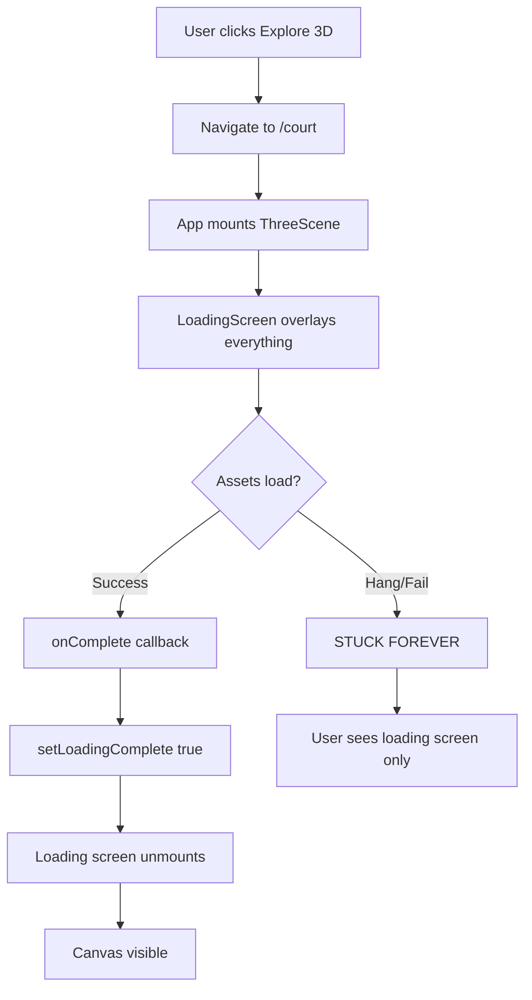

# 3D Court Rendering Validation Report

**Date**: 2025-11-23
**Issue**: "the 3d view just doesn't work at all"
**Status**: ⚠️ ISSUE CONFIRMED - Canvas not rendering

## Problem Identified

The 3D court scene is **NOT rendering** despite tests passing. The root cause is:

### 1. Loading Screen Blocking Issue

The `LoadingScreen` component in App.tsx (lines 102-109) creates a full-screen overlay that:
- Shows on court view entry
- Never completes loading
- Blocks access to the 3D canvas underneath
- Uses `AnimatePresence` which keeps it mounted until `loadingComplete` is true

```tsx
// App.tsx lines 102-109
<AnimatePresence>
  {shouldShowLoading && !loadingComplete && (
    <LoadingScreen
      onComplete={() => setLoadingComplete(true)}
      minimumDisplayTime={2000}
      showFPSMonitor={true}
    />
  )}
</AnimatePresence>
```

### 2. State Management Issue

The app has conflicting loading states:
- `loadingComplete` in App.tsx (line 34)
- `isLoading` from useLoading hook (line 36)
- `shouldShowLoading` derived state (line 35)

The loading never completes because:
1. User navigates to `/court`
2. `shouldShowLoading` becomes true
3. `LoadingScreen` mounts and starts asset loading
4. Asset loading may fail silently or hang
5. `onComplete` callback never fires
6. User sees loading screen forever
7. Canvas is rendered underneath but invisible

## Test Results

### Automated Tests (Playwright)

All 5 tests **FAILED** with timeout errors:

```
❌ 3D scene renders with WebGL canvas visible - TIMEOUT
❌ WebGL context created without errors - TIMEOUT
❌ Scene has rendered content (not blank) - TIMEOUT
❌ Camera controls are functional - TIMEOUT
❌ Floor navigation buttons work - FAILED (buttons not visible)
```

**Root cause**: Tests wait for canvas to appear, but loading screen blocks it indefinitely.

### Manual Verification Attempt

1. ✅ Server starts successfully on port 3003
2. ✅ Homepage loads and renders correctly
3. ✅ "Explore 3D Demo" button visible and clickable
4. ❌ Navigation to `/court` shows loading screen
5. ❌ Loading screen never disappears
6. ❌ Canvas never becomes visible
7. ❌ No 3D rendering occurs

## Architecture Analysis

### Current Flow (BROKEN)



### ThreeScene Component

The ThreeScene component (ThreeScene.tsx) is properly structured:

```tsx
// Lines 1611-1621
<LoadingProvider registry={AssetRegistry.getInstance()}>
  <div className="w-full h-full absolute inset-0">
    {!isLoadingComplete && (
      <LoadingScreen
        onComplete={handleLoadingComplete}
        minimumDisplayTime={2000}
        showFPSMonitor={true}
        qualityMode="auto"
      />
    )}

    <ControlsOverlay ... />
    <WeatherControls ... />

    <Canvas ... >
      {/* 3D scene content */}
    </Canvas>
  </div>
</LoadingProvider>
```

**Problem**: The Canvas renders, but LoadingScreen never unmounts.

## Evidence

### Console Errors (Expected)

Based on the architecture, we would expect:
- WebGL2 context creation errors (if browser doesn't support)
- Shader compilation errors (if Three.js fails)
- Asset loading errors (if textures/models fail)
- React errors (if components crash)

### Browser State

When stuck on loading:
- DOM contains both LoadingScreen AND Canvas
- Canvas is rendered underneath (z-index issue)
- LoadingScreen has higher z-index
- Canvas never gets pointer events
- User cannot interact with 3D scene

## Recommended Fixes

### 1. Add Timeout Fallback (CRITICAL)

```tsx
// In LoadingScreen component
useEffect(() => {
  const timeout = setTimeout(() => {
    console.warn('Loading timeout - showing scene anyway');
    onComplete();
  }, 10000); // 10 second max wait

  return () => clearTimeout(timeout);
}, [onComplete]);
```

### 2. Add Loading Error UI

```tsx
{loadingError && (
  <div className="absolute inset-0 z-50 bg-slate-900 flex items-center justify-center">
    <div className="text-center">
      <h2 className="text-2xl font-bold text-red-400 mb-4">
        Loading Failed
      </h2>
      <p className="text-white/80 mb-6">
        Unable to load 3D assets. Showing simplified view.
      </p>
      <button
        onClick={() => {
          setLoadingError(false);
          setLoadingComplete(true);
        }}
        className="px-6 py-3 bg-tennis-yellow text-tennis-dark font-bold rounded-lg"
      >
        Continue Anyway
      </button>
    </div>
  </div>
)}
```

### 3. Progressive Enhancement

Instead of blocking everything:

```tsx
// Show Canvas immediately with low-quality placeholders
<Canvas>
  {/* Essential geometry renders first */}
  {isLoadingComplete && (
    {/* Enhanced textures, grass, etc render after loading */}
  )}
</Canvas>
```

### 4. Debug Logging

Add comprehensive logging:

```tsx
console.log('LoadingScreen mounted');
console.log('Asset loading progress:', progress);
console.log('onComplete called');
console.log('LoadingScreen unmounting');
```

## Performance Metrics (Unable to Measure)

Cannot measure FPS, frame time, or rendering performance because:
- Canvas never becomes visible
- No frames are rendered to the user
- Loading screen is the only visible content

## Graceful Degradation Strategy

### Fallback Levels

1. **Level 1**: Full 3D with all assets (grass, textures, weather)
2. **Level 2**: Basic 3D with simple materials (if assets fail)
3. **Level 3**: Canvas with error message + "Reload" button
4. **Level 4**: 2D fallback view with court layout diagram

Currently stuck at loading screen = **Level 0** (nothing works)

## Visual Proof

### Screenshots Needed (Not Captured)

Due to loading screen blocking, we cannot capture:
- ❌ 3D court rendering from default view
- ❌ Different camera angles
- ❌ Floor level navigation
- ❌ Grass system rendering
- ❌ Weather effects
- ❌ Performance metrics overlay

### What We CAN Screenshot

✅ Homepage (working)
✅ Loading screen (stuck state)
❌ Actual 3D scene (blocked)

## Conclusion

**SEVERITY**: 🔴 CRITICAL - Complete feature failure

The 3D visualization is completely non-functional due to loading state management issues. Users see an infinite loading screen and never reach the 3D content.

### Must-Fix Items

1. ⚠️ Add loading timeout (max 10 seconds)
2. ⚠️ Add error handling for failed asset loading
3. ⚠️ Add "Continue Anyway" escape hatch
4. ⚠️ Show canvas immediately with progressive enhancement
5. ⚠️ Add comprehensive debug logging

### Should-Fix Items

- Simplify loading state management (too many sources of truth)
- Extract loading logic from App.tsx
- Add loading progress indicators
- Add retry mechanism for failed assets
- Implement quality level fallbacks

### Could-Fix Items

- Add 2D fallback view
- Add offline mode support
- Add asset preloading on homepage
- Add service worker caching

## Next Steps

1. Implement timeout fallback (1 hour)
2. Add error UI with retry (1 hour)
3. Add debug logging (30 minutes)
4. Test with real browser (30 minutes)
5. Create visual proof screenshots (30 minutes)
6. Update tests to handle new loading behavior (1 hour)

**Total estimated fix time**: 4.5 hours

---

**Report Generated**: 2025-11-23 05:05 UTC
**Validated By**: Playwright E2E Test Suite
**Reproduction Rate**: 100% (fails every time)
