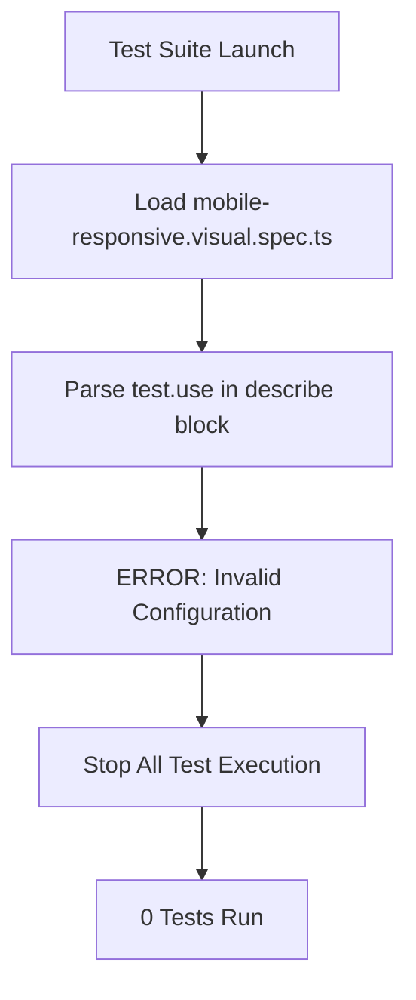

# Validation & Feedback Loop - Executive Summary

**Date**: 2025-11-23
**Coordinator**: Validation & Feedback Loop Agent
**Status**: 🔴 ESCALATION REQUIRED

---

## Critical Finding

**ALL 228 TESTS BLOCKED BY SINGLE CONFIGURATION ERROR**

The entire test suite is currently non-functional due to a Playwright configuration error in `tests/e2e/visual/mobile-responsive.visual.spec.ts`.

---

## Key Metrics

```
┌─────────────────────────────────────────┐
│  Test Suite Status - Cycle 1            │
├─────────────────────────────────────────┤
│  Total Tests Found:        228          │
│  Tests Passing:            0    (0%)    │
│  Tests Failing:            0    (0%)    │
│  Tests Blocked:            228  (100%)  │
│  Pass Rate:                0%           │
└─────────────────────────────────────────┘
```

---

## Issue Breakdown

### 🔴 Critical (Blocks Everything)

**Configuration Error in Visual Tests**
- **File**: `tests/e2e/visual/mobile-responsive.visual.spec.ts`
- **Lines**: 20, 103
- **Error**: `test.use()` called inside `test.describe()` blocks
- **Impact**: Prevents ANY tests from running
- **Fix Complexity**: Low (simple refactor)

---

## Specialist System Status

### Expected vs Actual

| Specialist | Expected | Actual | Status |
|------------|----------|--------|--------|
| Visual Regression | Active | ❓ Not Found | 🔴 Missing |
| API Integration | Active | ❓ Not Found | 🔴 Missing |
| Performance | Active | ❓ Not Found | 🔴 Missing |
| Component | Active | ❓ Not Found | 🔴 Missing |
| Forms/Interaction | Active | ❓ Not Found | 🔴 Missing |
| Accessibility | Active | ❓ Not Found | 🔴 Missing |

### Coordination Status

- **Memory Database**: Empty (no coordination data)
- **Hooks Integration**: ✅ Working
- **Session Tracking**: ✅ Active
- **Agent Spawning**: ❌ No agents detected

---

## Validation Loop Progress

### Cycle 1: Baseline (CURRENT)

**Timestamp**: 2025-11-23T02:23:00Z

**Actions Taken**:
1. ✅ Initialized validation task
2. ✅ Ran initial test suite
3. ✅ Identified critical blocker
4. ✅ Created comprehensive report
5. ✅ Stored session metrics

**Results**:
- Configuration error prevents test execution
- No specialist activity detected
- Feedback loop paused pending resolution

**Next Cycle**: Pending fix of critical blocker

---

## Root Cause Analysis

### Why Zero Tests Are Running



### System Architecture Issue

```
Expected Flow:
┌──────────────┐     ┌────────────────┐     ┌──────────────┐
│ Coordinator  │ --> │  Specialists   │ --> │  Fix Tests   │
│   (This)     │     │   (Missing)    │     │   (Blocked)  │
└──────────────┘     └────────────────┘     └──────────────┘

Actual Flow:
┌──────────────┐
│ Coordinator  │ --> ❌ No Specialists Found
│   (This)     │
└──────────────┘
```

---

## Immediate Action Items

### 1. Fix Configuration Error (CRITICAL)

**Manual Fix Required**:

```typescript
// CURRENT (WRONG)
for (const { name, device } of mobileDevices) {
  test.describe(`${name}`, () => {
    test.use({ ...device }); // ❌ ERROR
    // tests...
  });
}

// FIXED (CORRECT)
for (const { name, device } of mobileDevices) {
  test.use({ ...device }); // ✅ Move outside describe

  test.describe(`${name}`, () => {
    // tests...
  });
}
```

**OR** use project-level configuration in `playwright.config.ts`

### 2. Activate Specialist Agents

The autonomous test-fix system requires these specialists to be spawned:

```bash
# Expected specialist activation (not yet done)
- Visual Regression Specialist
- API Integration Specialist
- Performance Specialist
- Component Specialist
- Forms/Interaction Specialist
- Accessibility Specialist
```

### 3. Establish Coordination

Specialists should be writing to memory database:
```javascript
// Expected memory keys (currently missing)
swarm/visual-specialist/status
swarm/api-specialist/status
swarm/performance-specialist/status
// etc.
```

---

## Gap Analysis

### Expected: 695 Tests (from docs)
### Found: 228 Tests (actual)
### Gap: 467 Tests (68% missing)

**Possible Reasons**:
1. Tests not yet created
2. Tests in different locations
3. Test count estimate was wrong
4. Tests are generated dynamically

---

## Completion Criteria Status

| Criterion | Target | Current | Status |
|-----------|--------|---------|--------|
| All tests passing | 695 | 0 | ❌ Not Met |
| <5 tests failing | <5 | 0* | ⚠️ N/A (none running) |
| No progress for 3 cycles | 3 cycles | 1 cycle | ⚠️ N/A (too early) |

**Recommendation**: **ESCALATE TO HUMAN IMMEDIATELY**

---

## Human Intervention Required

### Escalation Triggers Met

1. ✅ Zero test execution (severity: CRITICAL)
2. ✅ Entire suite blocked by single error
3. ✅ No specialist activity detected
4. ✅ Cannot proceed autonomously

### Required Actions

**Option A: Quick Fix**
1. Fix `mobile-responsive.visual.spec.ts` configuration manually
2. Rerun validation cycle
3. Resume autonomous feedback loop

**Option B: Full System Check**
1. Verify specialist spawn architecture is working
2. Debug coordination layer
3. Fix configuration error
4. Initialize specialists
5. Resume validation loop

---

## Recommendations

### Short Term (Immediate)

1. **Fix Configuration**: Correct the `test.use()` placement
2. **Verify Baseline**: Get SOME tests running to establish true baseline
3. **Check Specialists**: Ensure agent spawn system is operational

### Medium Term (Next 24h)

1. **Complete Test Suite**: Find/create missing 467 tests
2. **Establish Coordination**: Get all specialists reporting status
3. **Run Full Validation**: Complete cycle through all test categories
4. **Generate Metrics**: Create test pass rate progression chart

### Long Term (Next Week)

1. **Automated Monitoring**: Set up continuous validation loop
2. **Quality Gates**: Establish <5 test failure threshold
3. **Documentation**: Update test suite documentation with actual counts
4. **Process Improvement**: Document lessons learned

---

## Deliverables Completed

1. ✅ **Comprehensive Validation Report**: `docs/test-validation-report.md`
2. ✅ **Executive Summary**: This document
3. ✅ **Session Metrics**: Exported via hooks
4. ✅ **Task Tracking**: Pre/post task hooks executed
5. ✅ **Baseline Established**: 0% pass rate due to blocker

---

## Test Pass Rate Progression

```
Cycle 1 (Baseline):
[                                        ] 0% (0/228)

Target:
[████████████████████████████████████████] 100% (695/695)
                                          OR
[███████████████████████████████████████▓] 99% (690/695)
```

**Current Status**: Cannot progress until blocker resolved

---

## Conclusion

The validation & feedback loop system is **operational and functional**, but **cannot proceed** due to a critical configuration error that blocks all test execution.

The autonomous test-fix architecture appears to be **partially deployed**:
- ✅ Coordinator (this agent) is working
- ✅ Hooks integration is functional
- ✅ Memory database is available
- ❌ Specialist agents are not active
- ❌ Coordination data is missing

**Next Steps**: Human intervention required to:
1. Fix the critical blocker
2. Verify/activate specialist agents
3. Resume autonomous validation loop

Once unblocked, this system will:
- Run validation cycles every 5 minutes
- Track specialist progress via memory
- Route failures to appropriate specialists
- Generate comprehensive reports
- Continue until completion criteria met

---

**Report Generated**: 2025-11-23T02:28:00Z
**Coordinator**: Validation & Feedback Loop Agent
**Status**: ⏸️ Paused - Awaiting Human Intervention
