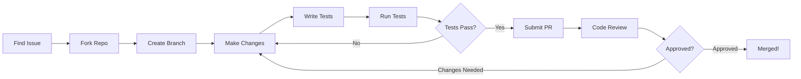

# LawnTech Dynamics - Quick Start for Contributors

**Want to contribute? Here's everything you need in 5 minutes!** ⚡

## ⏱️ 60-Second Setup

```bash
# 1. Fork on GitHub, then:
git clone https://github.com/YOUR_USERNAME/ace.git
cd ace

# 2. Install and run
npm install
npm run dev

# 3. Open http://localhost:3000
# You're ready to contribute! 🎉
```

## 📋 First Contribution Checklist

```
[ ] Read Code of Conduct (docs/CODE_OF_CONDUCT.md)
[ ] Review Contributing Guide (docs/CONTRIBUTING.md)
[ ] Find a "good first issue" on GitHub
[ ] Fork the repository
[ ] Create a feature branch
[ ] Make your changes
[ ] Write tests (npm run test)
[ ] Submit pull request
```

## 🎯 Where to Contribute

Pick your area of interest:

### 🏗️ Facility Design
- **What**: Floor plans, spatial optimization, safety
- **Files**: `docs/blueprint.md`, `docs/designs/`
- **Skills**: Architecture, AutoCAD, safety compliance

### 🎨 3D Visualization
- **What**: Three.js scenes, textures, rendering
- **Files**: `components/ThreeScene.tsx`, textures
- **Skills**: Three.js, WebGL, 3D modeling

### 🤖 Algorithms
- **What**: Grass growth, scheduling, optimization
- **Files**: `src/algorithms/` (create new)
- **Skills**: TypeScript, algorithms, simulation

### 📊 Analytics
- **What**: Performance tracking, AI features
- **Files**: `services/`, AI components
- **Skills**: React, AI/ML, data visualization

### 📚 Documentation
- **What**: Guides, tutorials, translations
- **Files**: `docs/`, `claudedocs/`
- **Skills**: Technical writing, languages

### 🧪 Testing
- **What**: Unit, E2E, visual tests
- **Files**: `tests/`, `*.test.ts`
- **Skills**: Vitest, Playwright, testing

## 🚀 Contribution Workflow



**Step-by-step**:

1. **Find Issue** → Browse [GitHub Issues](https://github.com/kvnloo/ace/issues)
2. **Fork Repo** → Click "Fork" on GitHub
3. **Create Branch** → `git checkout -b feature/your-feature`
4. **Make Changes** → Code, design, or document
5. **Write Tests** → Add tests for new functionality
6. **Run Tests** → `npm run test && npm run test:e2e`
7. **Submit PR** → Push and create pull request
8. **Code Review** → Address feedback from maintainers
9. **Merged!** → Celebrate your contribution! 🎉

## 📖 Essential Reading

**Must Read** (5 min):
- [CODE_OF_CONDUCT.md](CODE_OF_CONDUCT.md) - Community standards
- This document - You're already here!

**Should Read** (15 min):
- [CONTRIBUTING.md](CONTRIBUTING.md) - Detailed contribution guide
- [LICENSE.md](LICENSE.md) - Licensing overview

**Reference When Needed**:
- [GOVERNANCE.md](GOVERNANCE.md) - How the project is run
- [OPEN_SOURCE_GUIDE.md](OPEN_SOURCE_GUIDE.md) - Comprehensive guide

## 🛠️ Common Commands

### Development
```bash
npm run dev          # Start dev server (port 3000)
npm run build        # Build for production
npm run preview      # Preview production build
```

### Testing
```bash
npm run test              # Run unit tests
npm run test:watch        # Watch mode for tests
npm run test:e2e          # End-to-end tests
npm run test:e2e:ui       # E2E with UI
npm run test:all          # Run all tests
```

### Code Quality
```bash
npm run lint              # Check code style
npm run lint:fix          # Auto-fix style issues
npm run type-check        # TypeScript type checking
```

## 📝 Commit Message Format

```
type(scope): brief description

Detailed explanation (optional)

Closes #issue_number
```

**Types**: `feat`, `fix`, `docs`, `style`, `refactor`, `perf`, `test`, `chore`

**Examples**:
```
feat(3d): add realistic grass blade rendering

Implements instanced mesh rendering for grass blades
with wind animation shaders.

Closes #42
```

```
fix(ai-chat): resolve streaming timeout

Increases timeout threshold and adds retry logic.

Fixes #87
```

## 💡 Finding Your First Issue

**Look for labels**:
- `good first issue` - Perfect for newcomers
- `help wanted` - We need assistance
- `documentation` - Writing-focused
- `bug` - Something to fix
- `enhancement` - New feature ideas

**Browse by area**:
1. Go to [Issues](https://github.com/kvnloo/ace/issues)
2. Filter by labels that match your skills
3. Read issue description
4. Comment "I'd like to work on this!"
5. Wait for maintainer assignment

## ✅ Pull Request Checklist

Before submitting your PR:

```
[ ] Code follows project style (run npm run lint)
[ ] All tests pass (npm run test:all)
[ ] New tests added for new features
[ ] Documentation updated (if needed)
[ ] Commit messages are descriptive
[ ] Branch is up to date with main
[ ] PR description is clear
[ ] Related issues linked
```

## 🏆 Recognition

**Your contributions will be recognized through**:
- Git commit history (automatic)
- CONTRIBUTORS.md file
- Release notes for significant work
- Special mentions for major contributions

## 📜 License Quick Reference

| What You're Contributing | License |
|--------------------------|---------|
| Code (TypeScript/JS) | MIT (permissive) |
| Facility designs | CC-BY-SA 4.0 (share-alike) |
| 3D models | CC-BY-SA 4.0 (share-alike) |
| Documentation | CC-BY-SA 4.0 (share-alike) |

**What this means**:
- ✅ You retain copyright
- ✅ Project can use your contribution
- ✅ You get credit
- ✅ You can use it elsewhere too

**See [LICENSE.md](LICENSE.md) for details**

## 🤝 Community Standards

**We expect**:
- Respectful communication
- Constructive feedback
- Professional collaboration
- Patience with newcomers

**We don't tolerate**:
- Harassment or discrimination
- Trolling or personal attacks
- Unprofessional conduct

**Full details**: [CODE_OF_CONDUCT.md](CODE_OF_CONDUCT.md)

## 💬 Getting Help

**Stuck?** Here's where to ask:

| Question Type | Where to Ask |
|---------------|--------------|
| "How do I...?" | [GitHub Discussions](https://github.com/kvnloo/ace/discussions) |
| "This broke..." | [GitHub Issues](https://github.com/kvnloo/ace/issues) |
| "Can we add...?" | [GitHub Issues](https://github.com/kvnloo/ace/issues) (enhancement) |
| "I found a bug..." | [GitHub Issues](https://github.com/kvnloo/ace/issues) (bug) |

**Response times**:
- Issues: Reviewed within 48 hours
- Pull Requests: Reviewed within 3-7 days
- Discussions: Community responds

## 🎓 Learning Resources

**New to open source?**
- [GitHub's Open Source Guide](https://opensource.guide/)
- [First Timers Only](https://www.firsttimersonly.com/)
- [How to Contribute to Open Source](https://opensource.guide/how-to-contribute/)

**New to Three.js?**
- [Three.js Documentation](https://threejs.org/docs/)
- [Three.js Journey](https://threejs-journey.com/)
- [React Three Fiber](https://docs.pmnd.rs/react-three-fiber/)

**New to TypeScript?**
- [TypeScript Handbook](https://www.typescriptlang.org/docs/handbook/intro.html)
- [TypeScript Deep Dive](https://basarat.gitbook.io/typescript/)

**New to React?**
- [React Documentation](https://react.dev/)
- [React Tutorial](https://react.dev/learn)

## 🔥 Quick Tips

**Do**:
✅ Start small (fix typos, add tests)
✅ Ask questions early
✅ Follow existing code patterns
✅ Write descriptive commit messages
✅ Be patient with review process

**Don't**:
❌ Make huge PRs (break them up)
❌ Change unrelated code
❌ Skip tests
❌ Ignore feedback
❌ Take rejection personally

## 🎯 Project Goals

**We're building**:
- World's first autonomous grass court facility
- Open source facility design
- AI-powered operations
- Sustainable sports technology

**We value**:
- Open innovation
- Quality over quantity
- Community collaboration
- Long-term sustainability

## 📊 Project Status

**Current Phase**: Early development
**Active Contributors**: Growing community
**Contribution Areas**: All areas open
**Next Milestone**: First beta release

## 🚀 Ready to Contribute?

**You're all set!** Pick a task and dive in:

1. 🔍 [Browse Issues](https://github.com/kvnloo/ace/issues)
2. 📖 Review [CONTRIBUTING.md](CONTRIBUTING.md)
3. 💻 Fork, code, test
4. 📬 Submit your first PR
5. 🎉 Join the community!

**Questions?** Open a [Discussion](https://github.com/kvnloo/ace/discussions)

**Found a bug?** Open an [Issue](https://github.com/kvnloo/ace/issues)

**Have an idea?** We'd love to hear it!

---

**Welcome to LawnTech Dynamics! Every contribution makes a difference. 🎾 🤖 🌱**

*Last Updated: 2025-11-22*
