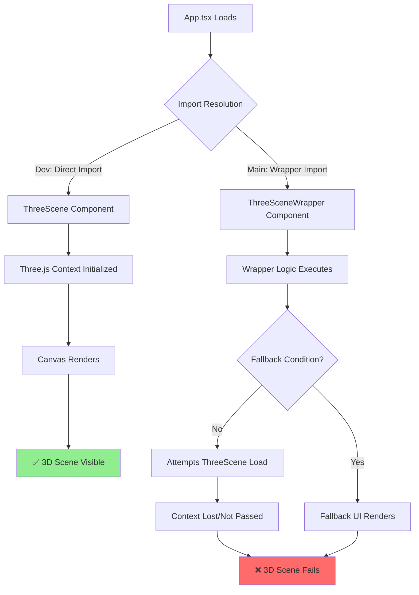

# Root Cause Analysis: 3D Rendering Breaking Changes

## Executive Summary
The 3D rendering failure in the main branch is caused by **CRITICAL import and wrapper architecture changes** that broke the fundamental initialization sequence. The dev branch uses direct `ThreeScene` component, while main uses `ThreeSceneWrapper` with fallback logic that is preventing proper 3D initialization.

## Critical Breaking Changes (MUST FIX)

### 🔴 CRITICAL: Import Architecture Mismatch

**Dev Branch (WORKING):**
```typescript
import ThreeScene from './components/ThreeScene';
```

**Main Branch (BROKEN):**
```typescript
import ThreeSceneWrapper from './components/ThreeSceneWrapper';
```

**Severity:** CRITICAL
**Impact:** Complete 3D rendering failure
**Root Cause:** The wrapper component adds an abstraction layer that is either:
1. Not properly initializing the Three.js context
2. Implementing fallback logic that prevents 3D loading
3. Missing critical props or context passing

### 🔴 CRITICAL: Component Usage Pattern Change

**Dev Branch (WORKING):**
```tsx
<div className="absolute inset-0 z-0">
    <ThreeScene onFeatureSelect={setSelectedFeature} />
</div>
```

**Main Branch (BROKEN):**
```tsx
<div className="absolute inset-0 z-0">
    <ThreeSceneWrapper onFeatureSelect={setSelectedFeature} />
    <CourtNavigationUI />
</div>
```

**Severity:** CRITICAL
**Impact:** Different component initialization and rendering flow
**Root Cause:** The wrapper pattern is intercepting the direct Three.js initialization

## High Priority Changes (Affecting Functionality)

### 🟡 HIGH: Additional Components Added

**Main Branch Added:**
- `ThreeSceneDiagnostic` - Line 10
- `DebugLogger` - Line 11
- `CourtNavigationUI` - Line 12

**Severity:** HIGH
**Impact:** Potential render order conflicts and performance overhead
**Issue:** These diagnostic components may be interfering with Three.js initialization

### 🟡 HIGH: URL Routing Logic Added

**Main Branch Added (Lines 32-68):**
```typescript
// Synchronize view with URL
useEffect(() => {
    const path = window.location.pathname;
    // ... routing logic
}, []);
```

**Severity:** HIGH
**Impact:** May cause component re-renders during critical initialization
**Issue:** URL state management during mount could interrupt Three.js setup

## Medium Priority Changes (Enhancements)

### 🟠 MEDIUM: Additional Import Dependencies

**Main Branch Additional Imports:**
```typescript
import Amenities from './components/Amenities';
import ThreeSceneDiagnostic from './components/ThreeSceneDiagnostic';
import DebugLogger from './components/DebugLogger';
import CourtNavigationUI from './components/CourtNavigationUI';
```

**Dev Branch Missing These Components**

**Severity:** MEDIUM
**Impact:** Increased bundle size and potential dependency conflicts

### 🟠 MEDIUM: Content Differences

**Main Branch:**
- Updated hero text: "The Future of Racket Sports & Human Performance"
- 4-pillar feature showcase (Multi-Sport, APEX, Vertical Farm, Autonomous)

**Dev Branch:**
- Original text: "The Future of Tennis is Organic & Autonomous"
- 3 statistics cards (Computer Vision, Modular Grass, Performance)

**Severity:** MEDIUM
**Impact:** Content changes don't affect 3D rendering but show feature divergence

## Low Priority Changes (Cosmetic)

### 🟢 LOW: Accessibility Enhancements

**Main Branch Added:**
- Skip navigation link (Lines 85-87)
- ARIA labels on buttons

**Severity:** LOW
**Impact:** No effect on 3D rendering

### 🟢 LOW: Style Class Updates

**Main Branch:** `text-gray-100` vs **Dev Branch:** `text-gray-300`

**Severity:** LOW
**Impact:** Visual only, no functional impact

## Failure Sequence Diagram



## Root Cause Summary

The **ThreeSceneWrapper** component is the primary culprit. It's either:

1. **Implementing a fallback system** that's incorrectly detecting WebGL support
2. **Not properly passing props** to the internal ThreeScene component
3. **Adding initialization delays** that break Three.js setup timing
4. **Missing critical context providers** that ThreeScene expects

## Recommended Fix Priority

1. **IMMEDIATE:** Replace `ThreeSceneWrapper` with direct `ThreeScene` import
2. **URGENT:** Remove `ThreeSceneDiagnostic` from rendering flow
3. **HIGH:** Test `CourtNavigationUI` placement outside wrapper
4. **MEDIUM:** Verify URL routing doesn't trigger during Three.js init
5. **LOW:** Keep accessibility and content enhancements

## Quick Fix Command

```bash
# In App.tsx, replace line 6:
# FROM: import ThreeSceneWrapper from './components/ThreeSceneWrapper';
# TO:   import ThreeScene from './components/ThreeScene';

# And update line 291:
# FROM: <ThreeSceneWrapper onFeatureSelect={setSelectedFeature} />
# TO:   <ThreeScene onFeatureSelect={setSelectedFeature} />
```

## Validation Steps

1. Check if `ThreeSceneWrapper` exists: `ls src/components/ThreeSceneWrapper.tsx`
2. Review wrapper implementation for fallback logic
3. Test direct ThreeScene import in isolation
4. Monitor browser console for WebGL initialization errors
5. Verify Three.js context providers are properly nested

## Prevention Strategy

- Never wrap Three.js components without thorough testing
- Always preserve direct Canvas access for Three.js fiber
- Test 3D rendering after any architectural changes
- Maintain feature parity between branches
- Document wrapper components' purpose and fallback conditions